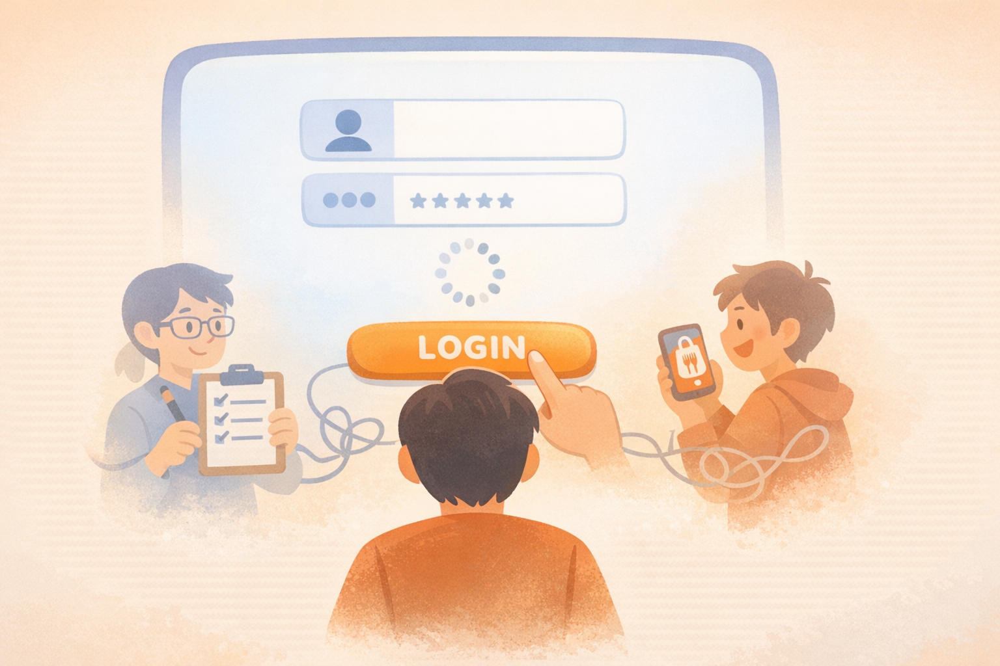

# 프롤로그: 심리적 지연을 풀고 시작하기

재테크는 머리로 이해하는 것보다, 몸이 움직이기까지가 더 어렵다. 이 프롤로그는 '심리적 지연(Lag)'이라는 말로, 왜 사람들이 계획은 세우면서도 실행은 못 하는지부터 풀어낸다.

이 책은 대박을 노리는 단기 플레이가 아니라, 로그아웃(파산/포기)하지 않고 오래 이기는 무한 게임을 목표로 한다. 완벽한 준비를 기다리기보다, 작고 안전한 시스템으로 "대충이라도 접속"하는 방식으로 출발한다.

이 책은 특정 상품을 대신 골라주는 정답지가 아니다. 독자가 자신의 재무환경을 이해하고, 장기투자와 분산투자, 자동화라는 기본 철학 위에서 안전하게 투자 언어를 배워 나가도록 돕는 첫 단추다. 본문에 나오는 표와 예시는 매수 지시가 아니라 구조를 이해하기 위한 지도이며, 시간이 지나 경험이 쌓이면 각자는 이 기본 철학을 바탕으로 자신만의 투자 방향성을 세워 갈 수 있다.

---

[체크인 질문]

> • 재테크를 시작하려 할 때 가장 먼저 떠오르는 감정은 무엇인가? (설렘, 공포, 막막함?)
> 
> • 완벽한 준비가 되었다고 느낄 때까지 기다리느라 미뤄온 경험은 무엇인가?

---

"아직 로딩 중인가? 아니면 '로그인' 버튼 위에서 손가락에 쥐가 났나?"
많은 사람이 재테크라는 게임 앞에서 '심리적 지연(Lag)'에 걸려 제자리에 멈춰 선다. 여기서 말하는 지연이란, 내가 입력한 대로 바로 반응이 오지 않거나 뚝뚝 끊기거나 화면이 멈춰 버리는 현상이다. 우리 마음도 똑같다. 머리(기획자 자아)는 “당장 저축해!” 하고 소리치는데, 몸(실행자 자아)은 이미 배달의민족 앱을 켜놓고 메뉴 고르는 중이다. 이게 바로 내면 자아들 사이의 지독한 소통 단절, 즉 심리적 지연의 실체다.

"공부 더 하고 시작할 거야", "수익률 대박 날 필살기 배운 뒤에 할 거야"라는 생각은 실행력을 제로로 만드는 전형적인 핑계다. 

<strong>이 부의 게임에서 가장 강력한 아이템은 IQ나 화려한 기술이 아니라 '시간'과 '인내심'이라는 소프트 스킬이다.</strong>

혹시 "난 이미 마흔인데, 쉰인데 너무 늦은 거 아냐?" 하면서 로그인을 망설이는가? 천만의 말씀이다! 기대수명이 길어진 시대에는, 지금 시작해도 생각보다 긴 시간이 남아 있다. 인생 풀타임으로 치면 지금이 하프타임을 지나 후반전으로 들어가는 타이밍일 수도 있다. 복리의 마법은 당신의 나이를 묻지 않는다. 그저 얼마나 오래 그 자리에 버티느냐만 따질 뿐이다.

저자가 말하는 '대충 접속하기'는 재테크를 대충 배우라는 뜻이 아니다. 오히려 잘 모를수록 욕심을 버리고, 단돈 만 원이라도 분산과 장기투자의 원리를 담은 안전한 시스템에 일단 몸을 실어보자는 뜻이다. 부의 축적은 머리로 이해하기 전에 "어? 진짜 돈이 불어나네?"라는 심리적 확신과 안정감을 가슴으로 먼저 경험해야 한다.

처음부터 대박 노리고 무리하게 뛰어들었다가 파산(로그아웃)당하면 평생 '투자의 트라우마'가 남는다. 하지만 작고 안전하게 시작해서 얻은 작은 성공의 기억은 끝까지 살아남게 만드는 강력한 방화벽이 된다.

그러니 완벽한 타이밍을 기다리느라 황금 같은 '시간'을 오래 방치하지 않아도 된다. 너무 작아 티도 안 날 것 같은 계획이라도 '안전한 실행'으로 일단 접속해 보면 된다. 그 안에서 쌓이는 건강한 투자 경험들이 당신을 진정한 부의 고인물(베테랑)로 안내할 것이다.

이 책은 당신의 심리적 지연을 풀어주고, 무리한 욕심 대신 '생존'을 최우선으로 하여 진정한 자유(내 시간을 내 뜻대로 쓰는 힘)를 얻도록 돕는 재무 코칭 가이드다.

자, 20대든 50대든 핑계는 이제 조용히 로그아웃시켜도 된다. 인생이라는 갓겜의 필드는 아직 넓고, 당신의 시간은 생각보다 충분하다. 지금 당장, 혹은 오늘 안에 아주 작은 버튼 하나만 눌러보면 된다.

호호 코치 최호석

---

[퀘스트 완료 레벨업 질문]

> • 오늘 당장 '대충'이라도 시작해 볼 수 있는 가장 작은 행동 한 가지는 무엇인가?
> 
> • 당신이 이 게임에서 '로그아웃'하지 않고 끝까지 살아남아야 하는 가장 큰 이유는 무엇인가?

---
