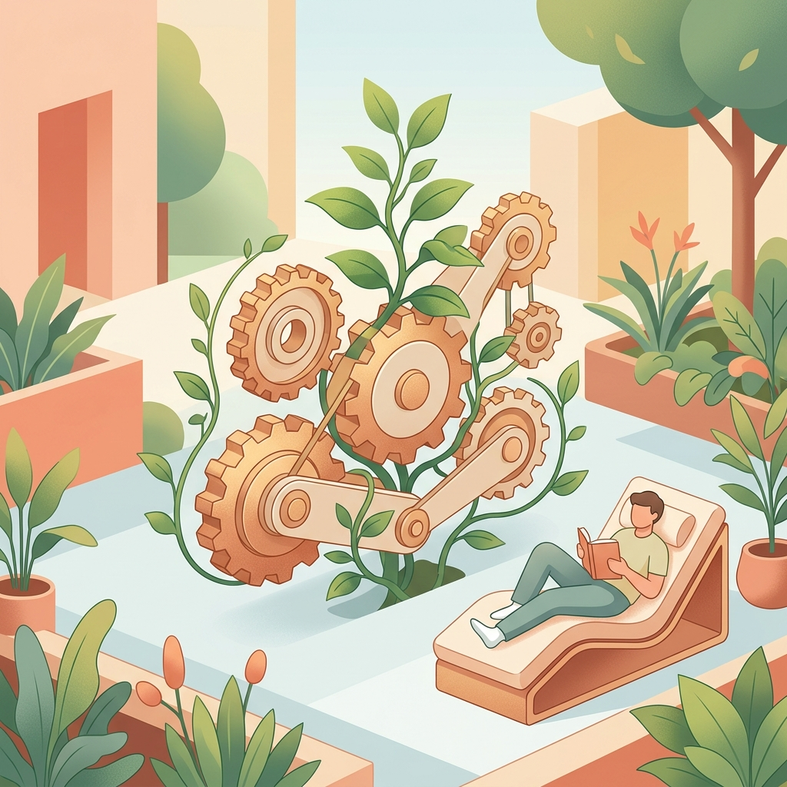
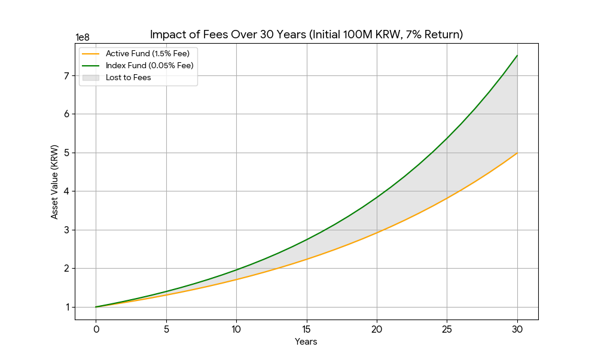

# 2. 부의 게임, ‘자동 사냥’ 모드로 전환하세요: 한 번 이해하고 평생 써먹는 시스템 설계

재테크가 내 일상을 갉아먹는 고된 노동이 되어서는 안 됩니다. 이 챕터에서는 기계적인 이성보다 따뜻한 합리성을 바탕으로, 한 번 구축하면 평생을 스스로 일하게 만드는 '자동 사냥(Auto-farming)' 시스템의 설계 원칙을 배웁니다. 당신의 소중한 에너지를 진짜 중요한 삶의 가치에 쏟을 수 있도록 돕는 시스템 구축의 첫걸음을 떼어 봅니다.

---

[체크인 질문]

> • 위의 요약 내용을 읽었을 때, 당신이 꿈꾸는 '자동 사냥' 시스템은 어떤 모습인가요?
> 
> • 재테크가 당신의 일상을 방해하지 않으면서도 자산을 키워줄 수 있다는 가능성에 대해 어떻게 생각하시나요?
> 
> • 현재 당신의 자산 관리 방식 중 '자동화'가 가장 시급하다고 느껴지는 부분은 어디인가요?

---

## 인생이라는 거대한 퀘스트에서 우리가 '자동 사냥'을 켜야 하는 이유
돈을 관리하는 일은 중요하지만, 우리 인생에는 돈보다 훨씬 더 많은 에너지를 쏟아야 할 소중한 순간들이 가득하다. 게임에서 캐릭터를 키우기 위해 밤새도록 단순 반복 사냥(노가다)만 할 수 없듯이, 우리 삶도 모든 것을 '수동 조작'으로 버티기엔 에너지가 부족하다. 각 세대별로 마주하는 현실적인 사건들을 보면 우리가 왜 재무 시스템을 '자동화'해야 하는지 알 수 있다.

**10대: 동아줄 잡고 생존하느라 바쁜 '뉴비'**
10대라는 성장의 계절은 '햇님 달님'의 남매가 호랑이에게 쫓기며 하늘에서 내려온 밧줄을 잡고 올라가는 절박한 시기다. 당신에겐 공부와 친구 관계라는 두 가닥 밧줄을 놓치지 않는 '생존'이 최우선이다. 국영수 문제집의 숲에서 호랑이(성적표)를 피해 도망치기도 벅찬데, 돈 걱정까지 수동으로 하느라 정작 중요한 인생의 동아줄을 놓칠 수는 없다. 등급 컷 확인하기도 바쁜 눈으로 주식 차트까지 볼 여유는 없으니까. 이때 필요한 건 든든한 '자동 사냥' 시스템이다. 동아줄만 꽉 잡아라. 경험치는 알아서 쌓이게.

**20대: 세이렌의 소비 유혹에 맞선 '항해사'**

20대는 꿈의 대양을 탐험하는 시기다. 오디세우스가 세이렌의 치명적인 노래를 이기기 위해 자신을 돛대에 묶었듯, 당신도 '플렉스(Flex)'와 '오마카세'라는 소비의 유혹으로부터 자신을 묶어둘 장치가 필요하다. 커리어라는 배의 키를 잡고 나만의 가치를 찾아 항해해야 할 귀한 청춘이다. 24시간 스마트폰 전광판만 들여다보며 일희일비하기엔 당신의 항로가 너무나 넓고 찬란하다. 청춘의 에너지를 차트에 낭비하지 않도록, 자산 관리는 '자동 항법 장치'에 맡기고 당신은 더 넓은 세상으로 나아가라.

**30대: 현실의 무게를 짊어진 '프로 수발러'**

30대의 우리는 흥부의 박처럼 대박을 꿈꾸지만, 현실은 박 속에서 나온 도깨비들에게 탈탈 털리는 기분일지도 모른다. 가족을 돌보고 커리어의 정점을 향해 달리는 이 시기, 아이의 첫걸음마나 배우자와의 눈맞춤보다 주식 차트의 빨간 막대가 더 중요할 수는 없다. 퇴근 후 지친 몸으로 아이와 놀아줄 체력조차 부족한데, 밤마다 미국 주식 개장까지 기다리며 '수동 관리'를 고집하는 건 고문에 가깝다. 가족과의 소중한 시간을 지키기 위해 '자동 사냥'을 켜둬라. 당신이 아이와 눈을 맞추는 사이, 자본은 알아서 쑥쑥 자라야 한다.

**40대 이상: 끼인세대의 '무한 레이드'**
40대를 넘기면 부모님 부양과 자녀 교육이라는 거대 보스 몬스터 사이에 끼인 '샌드위치 세대'의 무한 레이드가 시작된다. 체력은 포션(커피)으로 겨우 버티는데, 관리해야 할 돈의 가닥수는 늘어만 가다. 매일 수동으로 하나하나 따져가며 관리하다간 자산보다 혈압이 먼저 오를 판이다. 이제는 요령이 필요한 노련한 게이머가 되어야 할 때다. 직접 칼을 휘두르는 수동 사냥은 젊은 날의 패기로 족하다. 이제는 정교하게 세팅된 '자동화 부대'를 거느리고, 당신은 인생의 진정한 여유라는 보상을 누려야 한다.

**이 모든 세대가 공통으로 깨닫게 되는 진실 하나: 내가 현생의 가장 소중한 퀘스트들에 집중하는 동안에도, 자산이 안전하게 자라날 수 있도록 '자동 사냥' 모드를 켜야 한다.**

## "한 번 이해하고 평생 써먹는 시스템" 내 마음의 방화벽 설치하기

자동 사냥 모드는 단순히 돈이 알아서 불어나는 기계가 아니라, 내가 잠든 사이에도 투자의 세계에서 필연적으로 덤벼드는 '감정 괴물'들이 뇌를 흔들지 못하게 든든한 방화벽을 세우는 작업이다. 이 시스템은 돈 불리는 공식을 한 번 배우고 끝내는 게 아니라, 변동성·두려움·불확실성·의심·후회라는 다섯 마리 괴물을 잘 다스리기 위한 건강한 원칙과 마인드셋을 뇌에 영구 설치하는 것을 의미한다.

이 감정들은 투자의 성과를 얻기 위해 기꺼이 내야 하는 '입장료(수수료)'와 같다. 이를 '벌금'이라고 생각하면 도망치고 싶지만, 당연한 '수수료'라고 이해하면 끝까지 살아남아 복리의 열매를 맛볼 수 있다. 

우리가 이 게임에서 느끼게 될 감정들을 유머러스한 고전 예시로 살펴보자.

1. **변동성**: 손오공의 근두운을 탄 기분 서유기의 손오공은 구름을 타고 순식간에 수만 리를 날아가지만, 구름 위는 바람이 세고 위아래로 심하게 출렁인다. 내 계좌가 어제 천국이었다가 오늘 지옥으로 떨어지는 게 바로 이 '변동성'이다. "구름 고장 났다!"며 겁먹고 뛰어내리면(패닉 셀) 큰일 난다. 이 출렁임은 경제적 자유라는 서천으로 가기 위해 반드시 지불해야 할 비행 수수료일 뿐이다.

2. **두려움과 불확실성**: 호랑이보다 무서운 '곶감' 마켓 호랑이와 곶감 이야기에서 호랑이는 곶감이 뭔지도 모르면서 세상에서 가장 무서운 괴물이라고 착각해 도망친다. 투자자들도 '시장 폭락' 뉴스(곶감)만 나오면 실제 위험이 뭔지 따져보지도 않고 겁부터 먹는다. 무서운 건 시장 자체가 아니라, 불확실성 앞에서 요동치는 내 마음속 '상상 속 괴물'이다.

3. **의심과 후회**: 소금 짐을 진 당나귀의 꼼수 소금 짐 당나귀가 실수로 물에 빠져 소금이 녹아 짐이 가벼워지자 다음번엔 일부러 물에 뛰어든다. 하지만 솜 짐을 지고 물에 들어가 솜이 물을 먹어 무거워지는 바람에 고생한다. 투자하다 보면 "아, 그때 팔았어야 했어!", "남들은 저거 사서 대박 났대!" 하며 단기 꼼수를 부리고 싶은 의심과 후회가 밀려온다. 남의 게임에 휘둘려 꼼수를 쓰다가는 복리의 마법이라는 진짜 보물을 놓치게 된다.

결국 이 시스템은 어떤 예기치 못한 폭풍우가 와도 당신이 당황하지 않고, 실패를 '인생의 끝'이 아니라 '배움의 밑줄'로 읽어내며 성장 마인드셋을 유지하게 돕는 든든한 가이드가 될 것이다.

 

## 이제 '수동 컨트롤'의 시대는 끝났다.

이제 당신은 인생의 각 단계에서 마주할 험난한 퀘스트들을 수행하면서도, 재무적 '로그아웃'을 당하지 않게 해줄 든든한 '자동 사냥 모드'의 필요성을 충분히 느꼈을 것이다.

시스템의 원리를 깨달은 순간, 이미 절반은 성공이다. 당신이 잠든 사이에도, 아이와 눈 맞추는 순간에도, 본업이라는 거대 보스와 사투를 벌이는 와중에도 – 당신의 자본은 조용히 눈덩이를 굴리고 있다. 설령 도중 예기치 못한 버그(폭락, 실수, 후회)를 만나더라도, 그것을 '인생 끝장'이 아니라 '성장을 위한 패치 노트'로 읽어내는 마음의 근육만 있다면, 당신은 이 무한 게임의 '승리 확정' 라인에 이미 발을 들였다.

하지만 진짜 시스템을 가동하기 전에 마지막으로 점검해야 할 설정값이 하나 남아 있다. 바로 과거의 경험과 편견이 돈 앞에서 너를 조종하는 보이지 않는 대본, '머니 스크립트'다.

 그동안 왜 우리는 돈 앞에서 멀쩡한 척하면서도 '자폭급 미친 짓'을 반복할 수밖에 없었을까? 그 흥미진진한 심리 탐험의 문이 열린다. 당신의 머니 스크립트!

상세한 정보나 어려운 용어는 13장 부록을 참고하세요.

---

[퀘스트 완료 레벨업 질문]

> • 이 챕터에서 배운 '시스템 설계' 원칙 중 본인의 삶에 가장 먼저 적용하고 싶은 부분은 무엇인가요?
> 
> • 밤잠 설치지 않는 '따뜻한 합리성'을 발휘하기 위해, 당신의 자산 배분 비중을 현재보다 어떻게 조정하고 싶으신가요?
> 
> • 일주일 이내에 당신의 '자동 사냥' 모드를 켜기 위해 실천할 구체적인 첫걸음은 무엇인가요?

---
