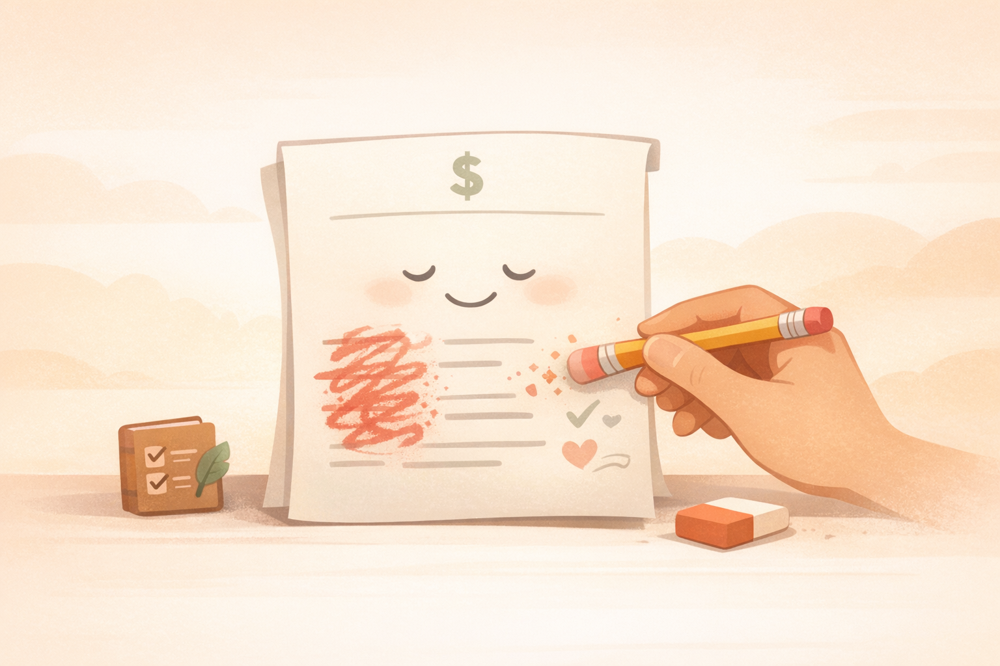

# 3. 당신의 통장은 죄가 없다, 기억이 문제지

우리는 각자 자신만의 렌즈를 통해 돈을 바라본다. 같은 통장 잔고를 보고도 어떤 사람은 안심하고, 어떤 사람은 불안해하며, 또 어떤 사람은 충동적으로 써버린다. 차이는 숫자만이 아니라 돈을 해석하는 마음속 기준에서 나온다. 이 장에서는 어린 시절의 기억과 반복된 경험이 어떻게 지금의 돈 선택에 영향을 주는지 살펴본다. 그리고 그 기준이 현재의 나를 가로막고 있다면, 어떻게 더 도움이 되는 방향으로 다시 써볼 수 있는지 함께 점검한다.

---

[체크인 질문]

> • 당신의 머릿속에 가장 먼저 떠오르는 돈과 관련된 어린 시절의 장면은 무엇인가?
> 
> • 그 기억이 현재 당신이 돈을 대하는 태도에 어떤 보이지 않는 영향을 주고 있다고 느껴지는가?
> 
> • 만약 당신의 돈에 대한 기억을 새롭게 해석할 수 있다면, 현재 겪고 있는 재무적 고민 중 어떤 것이 가장 먼저 가벼워지는가?

---

## 🏛️ 우주 도서관과 '팸플릿 한 장'의 저주
상상해 보자. 인류 경제사 2,000년의 자료가 꽉 들어찬 '광활한 우주 도서관'이 있다. 이곳엔 수억 권의 장서가 빼곡하지만, 우리가 태어나서 지금까지 직접 겪은 경제적 경험은 저 구석탱이 먼지 쌓인 서가에 꽂힌 '3페이지짜리 전단지' 분량도 안 된다.

<strong>결국 당신의 통장 잔고를 흔드는 것은 지식 부족만이 아니라, 뇌 속에 깊이 박혀 있는 '돈에 대한 마음속 대본'일 수 있다.</strong>

돈에 대한 마음속 대본이란 어린 시절의 돈 경험이 굳어서, 지금의 선택에 자동으로 영향을 주는 무의식의 기준이다. 돈 얘기만 나오면 회피하거나, 과소비하거나, 근거 없이 불안해지는 반복 반응이 여기에 속한다. 관련 연구에서도 돈에 대한 믿음의 틀을 따로 분류해 설명하지만, 이 책에서는 독자가 바로 이해할 수 있도록 '돈에 대한 마음속 대본'이라고 부르겠다.

이것이 바로 '한 줌 경험'을 '80%의 진리'로 둔갑시키는 뇌의 기막힌 사기극이다.

- **호돌군(성장기 주식 불장 경험)**: "투자가 뭐야? 그냥 사놓고 자고 일어나면 돈이 복사되는 연금술 아니야? (전단지 제목: '돈 복사기 사용 설명서')"
- **유리양(부모님의 주식 잔혹사 목격)**: "주식? 그거 한 번 발 들이면 패가망신해서 길바닥 나앉는 무서운 이야기 아냐? (전단지 제목: '지옥으로 가는 급행열차')"

결국 우리는 냉철한 분석가가 아니라, 우연히 손에 쥔 그 '꼬질꼬질한 팸플릿'이라는 색안경을 끼고 세상을 보는 편식쟁이 관찰자일 뿐이다.

## 📚 내 인생의 '팸플릿'이 만든 2가지 뇌피셜
우리의 뇌는 돈 문제뿐만 아니라 일상 곳곳에서 이 '전단지 한 장의 기적'을 시전한다. 아래 사례들은 정확한 연구 통계가 아니라, 경험이 판단을 과하게 지배하는 방식을 보여주는 이해용 예시다.

- 🍲 **엄마 집밥 팸플릿**: 어린 시절, 우리 집 된장찌개에 항상 멸치가 통째로 들어있었다. 그 맛이 뇌 속 '식문화 대백과'의 80%를 채운다.
현재의 행동: 미슐랭 3성급 셰프가 정성껏 끓인 된장찌개를 먹어도 속으로 생각한다. "음, 나쁘진 않은데... 멸치가 안 씹히니 근본이 부족하구먼." 요리란 맛이 아니라 '엄마 손맛 팸플릿'의 복사본일 뿐이다.

- 💕 **첫 연애 설렘 팸플릿**: 고등학교 때의 달달한 데이트 경험. 그 설렘이 '관계학 대백과'의 대부분을 차지한다.
현재의 행동: 지금 모든 관계를 "영화처럼 완벽해야 해"로 왜곡한다. 상대가 사소한 실수를 하면 "이게 진짜 사랑인가? 내 팸플릿엔 이런 장면 없는데!"라고 생각한다. 착각이 긍정적이지만, 현실을 왜곡하는 건 마찬가지다.

## ⚖️ "너는 옳고, 나는 맞다" : 다양성을 인정하는 우아한 시선
우리는 서로의 포트폴리오를 비난할 이유가 없다. 각자의 인생이라는 도서관에서 빌려온 '경험의 책'이 너무나 다르기 때문이다. 그 책 한두 권이 전 세계 금융 서적을 대신한다고 착각할 뿐, 실제로는 각자 다른 챕터만 읽은 거지.

'거시경제 망원경'의 시선은 큰 흐름을 먼저 본다. 금리 인상, 지정학적 위험, 금융위기 같은 거대한 파도를 여러 번 목격한 사람은 작은 조정만 와도 "또 시작이네" 하며 방어적으로 변한다. 반대로 '현장 밀착형 촉'의 시선은 내가 매일 쓰는 제품, 동네 상권, 주변 소비 습관 같은 가까운 단서에서 기회를 읽는다. 이 방식은 시장이 아직 모르는 변화를 빨리 느낄 수 있지만, 익숙한 것에만 과하게 몰리는 위험도 있다.

결국 둘 다 '틀린' 게 아니라, 각자 다른 렌즈로 세상을 보는 거다. 망원경 가진 사람은 현미경 들고 다니는 사람을 "세부만 보고 전체 못 봐"라고 까고, 현미경 가진 사람은 망원경 들고 다니는 사람을 "구름만 잡고 현실 몰라"라고 깐다.

하지만 진짜 문제는 서로의 렌즈를 빼앗으려는 게 아니라, 자기 렌즈만 고집하는 거다.

## 로또 당첨과 벼락 맞기의 기묘한 평행이론: 행운과 위험은 한 배에서 나왔다
행운과 위험은 보이지 않는 쌍둥이 형제다. 이들은 인생의 모든 결과에 강력한 영향을 끼친다. 우리는 종종 이들의 존재를 잊고 모든 결과를 자신의 노력과 실력으로만 돌리지만, 때로는 노력과 무관하게 발생하는 운의 몫이 크다.

손정의가 2000년에 알리바바에 2천만 달러를 투자한 건 극히 드문 시점의 행운이었다. 잭 마와의 만남은 짧았고(약 6분 정도), 당시 알리바바는 창업 1년 된 신생 기업에 불과했다. 중국 인터넷 시장이 폭발적으로 성장할 초기 단계였고, 그 흐름에 정확히 올라탄 결과 그 투자금은 이후 수십 년간 수백억 달러 이상의 가치로 불어났다. 마치 로또 1등 당첨자가 번호를 분석한 덕분이라고 주장하는 것처럼, 시점과 환경의 역할이 컸다.

반대로, 손정의가 이끄는 소프트뱅크가 위워크(WeWork)에 대규모 투자를 한 건 예상치 못한 위험의 전형이었다. 2017년부터 여러 차례 투자해 총 수십억 달러를 쏟아부었고, 2019년 초 위워크의 가치는 470억 달러까지 치솟았다. 그러나 IPO 준비 과정에서 막대한 손실과 지배구조 문제 등이 드러나면서 IPO가 무산됐고, 소프트뱅크는 구제 금융을 통해 회사를 지원하면서도 막대한 손실을 입었다(일부 보고서에 따르면 위워크 관련 총 손실은 100억 달러 이상으로 추정된다). 철저한 검토와 분석이 있었음에도 불구하고, 시장 상황과 예상치 못한 변수가 모든 걸 뒤집어버렸다.

당신이 투자한 주식이 자고 일어났더니 2배가 되었다면, 그것은 실력보다 형인 '행운'이 어깨를 툭 치고 지나갔기 때문일 가능성이 크다. 반대로 철저히 공부했음에도 폭락장을 맞았다면, 그것은 무능함보다는 동생인 '위험'이 장난친 결과일 수 있다.

성공했을 때 "난 투자의 신이야!"라고 외치는 건, 로또 당첨자가 "난 공 뽑기 기술의 달인이야!"라고 자랑하는 것만큼이나 우스운 착각이다. 손정의처럼 날카로운 직감과 대담한 비전이 있어도, 행운과 위험이 쌍으로 따라다니는 걸 보면 인생에는 노력과 운이 함께 작용한다는 사실을 새삼 느낀다.

## 첫 아이 기저귀 갈듯 서툴러도 괜찮아: 우리는 모두 '초보 엄빠' 투자자
인생이라는 게임은 야속하게도 '연습판'이 없다. 우리는 모두 단 한 번뿐인 인생을 처음 살아보는 사람들이다. 특히 지금 우리가 머리 싸매고 고민하는 '현대적 투자'라는 영역은 갓 걸음마를 뗀 아기나 다름없다.

인류가 지구상에 등장해 사냥하고 채집하며 살아온 시간은 수십만 년에 달한다. 그런데 지금처럼 스마트폰 한 번 누르는 것만으로 미국 주식을 사고팔고, 연금 저축을 고민하는 환경은 길게 잡아도 30~50년 정도밖에 안 된다.

인류 역사를 24시간으로 압축하면, 현대 금융 환경은 자정 직전 1~2초 만에 등장한 신참이다.
조상님들의 재테크는
- "옆 부족이 고기 뺏지 못하게 숨기기"
- "겨울 대비 곡식 잘 보관하기"
정도로였다면, 우리의 재테크는
- "미 연준 금리 점도표 읽기"
- "나스닥 지수 ETF를 나누어 살 시점 잡기"
가 된다.

우리 유전자에 각인된 건 '사냥 성공의 쾌감'과 '위험 피하기' 본능이지, '복리 이자의 마법'이나 '변동성의 아름다움'이 아니다.
그러니 복잡한 가격 그래프 앞에서 멍해지고, 뉴스 하나에 심장이 쿵쾅거리는 건 지능의 문제가 아니라, 진화 속도가 금융 상품 출시 속도를 따라가지 못하는 아주 자연스러운 현상이다.

💩 **기저귀 거꾸로 채워도, 옷에 조금 묻어도 괜찮다**
투자 초보 시절의 실수는 갓 태어난 첫 아이를 안은 초보 부모의 모습과 똑같다.
기저귀 하나 가는 데도 손이 떨리고, 실수로 분유를 너무 뜨겁게 타서 아기가 울어도,
"아, 난 육아에 소질 없나 봐. 포기할래!"라고 선언하는 부모는 거의 없다.

손실은 '아기의 울음소리'다. 계좌가 파란불로 울 때 가슴이 철렁 내려앉는 건, 부모로서 당연한 공감 능력이다.
실수는 '성장통'이다. 잡주에 물려보기도 하고, 남들 다 살 때 따라 샀다가 고점에서 하염없이 내려앉는 건, 육아로 치면 '분유 온도 조절 실패'나 '기저귀 새는 사고' 같은 거다. 한 번 뜨거운 맛을 봐야 다음엔 손에 감이 온다.

🌱 **당신은 지금 자산을 '양육'하는 중이다**
초보 부모가 책을 펼쳐보고, 선배 부모에게 물어보며 조금씩 익히듯, 우리도 투자라는 '아기'를 키워가는 중이다.
꾸준함은 '매일 밥 주기'다. 시장이 좋든 나쁘든 조금씩 넣는 습관이 장기적으로 가장 큰 힘을 발휘한다.
인내는 '밤새워 재우기'다. 시장이 요동쳐도 "지금은 울음기"라고 다독이며 기다리는 시간이다.
기저귀가 거꾸로 채워졌다고, 옷에 조금 묻었다고 자책하지 마라.
당신은 인생 1회차 부모로서, '자산'이라는 귀한 새끼를 정성껏 키우고 있는 중이다.
가끔 사고 치고, 울리고, 잠 못 이루겠지만, 시간이 흐르면 그 아이는 무럭무럭 자라 당신의 노후를 든든히 지켜줄 든든한 효자가 될 것이다.

<strong>"괜찮아, 원래 육아(재테크)는 실전하면서 배우는 거니까. 우리 다 같이 서툴러도 괜찮아."</strong>

## 기억의 편집실: 돈에 대한 마음속 대본 다시 쓰기
결국 당신의 통장 잔고를 흔드는 것은 현재의 경제 지식만이 아니라, 뇌 속에 깊이 박혀 있는 돈에 대한 오래된 대본일 수 있다.
"돈은 더러운 거야", "투자는 도박이야", "부자는 나쁜 놈들" 같은 우울한 대사들만 가득하다면, 좋은 기회가 코앞에 와도 입에서 나오는 말은 "난 안 할래"가 되기 쉽다.

자, 이제 이 낡은 대본을 차분히 편집실로 가져가 보자.
과거에 그런 일을 겪었으니 "내 인생은 비극으로 끝날 수밖에 없어"라는 생각? 아들러 심리학에서 말하는 '인생의 거짓말(허구적 최종성)'처럼, 과거 사건 자체는 못 바꾸지만 그 사건을 어떻게 해석하고 연결할지는 지금 당신 손에 달렸다.

예를 들어, "아버지가 사업에 망해서 우리 집은 항상 가난했어"라는 페이지를 그대로 두면 대본은 평생 비극 분위기다.
하지만 이렇게 다시 써볼 수 있다:
- 낡은 페이지 찢기: "그 실패는 내 운명이 아니라, 아버지의 한 번의 선택이었다."
- 새 장면 삽입: "그 사건 덕분에 나는 위험을 먼저 살피는 감각을 배웠다. 이제는 무리한 선택을 피하고 더 탄탄한 계획을 세울 수 있다."

이렇게 반전의 해석을 써넣으면, 지금까지 '공포 영화'였던 계좌가 갑자기 '성장 드라마'의 주인공처럼 보이기 시작한다.

**대본을 새로 쓰는 버튼 누르기**
당신의 통장이 지금 어떤 색이든, 그것은 어린 시절부터 쌓인 첫 번째 대본의 결과물일 뿐이다. 그때의 당신은 세상 물정 모르던 초보 작가였고, 그 대본 안에서는 늘 '최선'을 썼다.
다만 이제는 초안이 낡았다는 걸 알았으니, 새로운 장을 쓰는 거다. 과거를 탓할 필요 없다. 중요한 건 이 '기억'이라는 설정값을 어떻게 활용해 더 나은 이야기를 완성할지다.
자, 편집실 문을 열 준비가 됐는가? 낡은 대본을 다시 구성할 용기 하나만 내면 이미 절반의 성공이다.
다음 장에서는 타인의 시선과 과거의 상처를 다른 각도에서 바라보며, 재무 자유를 향해 다시 선택하는 법을 살펴본다.

잠깐, 오늘 10분만 써도 된다. 내 머릿속 팸플릿 제목을 한 줄로 적고, 그 대본이 지금의 나를 돕는지 가로막는지만 표시해 보자.

## Sources

- Klontz, B., Britt, S. L., Mentzer, J., & Klontz, T. (2011), "Money Beliefs and Financial Behaviors: Development of the Klontz Money Script Inventory", *Journal of Financial Therapy*, 2(1). DOI: https://doi.org/10.4148/jft.v2i1.451
- Morgan Housel, *The Psychology of Money* (Book) — 행운과 위험이 투자 결과에 미치는 영향에 대한 참고 관점
- Bloomberg Television, "Why Masayoshi Son Invested $20 Million in a Young Jack Ma" (2017): https://www.youtube.com/watch?v=vPt1PG-Kznk
- Reuters/Moneycontrol, "SoftBank's Masayoshi Son sticks with gut-led investing in chat with Alibaba's Jack Ma" (2019): https://www.moneycontrol.com/news/world/softbanks-masayoshi-son-sticks-with-gut-led-investing-in-chat-with-alibabas-jack-ma-4706071.html
- CNBC, "WeWork's $47 billion valuation was always a fiction created by SoftBank" (2019): https://www.cnbc.com/2019/10/22/wework-47-billion-valuation-softbank-fiction.html

---

[퀘스트 완료 레벨업 질문]

> • 이 챕터에서 발견한 당신만의 '돈에 대한 마음속 대본' 중 가장 먼저 수정하고 싶다고 느낀 부분은 무엇인가?
> 
> • 과거의 아픈 기억을 성장을 위한 '반전의 해석'으로 바꾸기 위해 당신이 새롭게 선택한 관점은 무엇인가?
> 
> • 새로운 돈의 대본을 익히기 위해, 오늘부터 일상에서 반복하고 싶은 구체적인 다짐이나 행동은 무엇인가?

---
