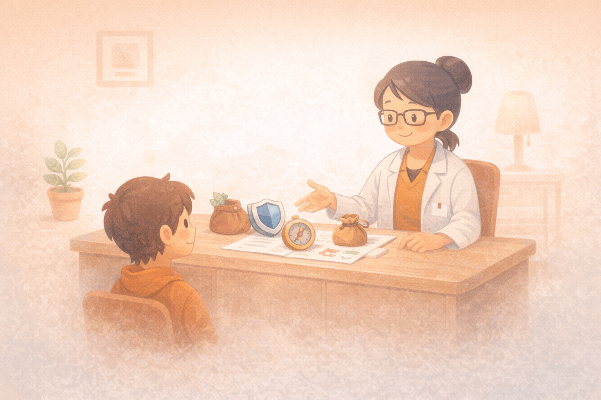

# 4. 아들러 씨의 재무 상담소: 돈 문제를 다시 보는 법(리프레이밍)

과거의 상처나 '끝난 것 같다'고 느껴지는 재무 상황은 끝이 아닌 새로운 시작의 발판이 될 수 있다. 아들러 심리학의 지혜를 빌려, 우리의 재무적 열등감을 성장의 동력으로 바꾸고 '지금, 여기'에서 승률을 높이는 리프레이밍 기술을 배운다. 타인의 시선에서 벗어나 오직 나침반만을 믿고 나아가는 용기에 대해 함께 고민해 본다.

---

[체크인 질문]

> • 위의 요약 내용을 읽었을 때, 당신의 재무 상태 중 '끝난 것 같다'고 느껴져 포기하고 싶었던 구체적인 순간은 언제인가?
> 
> • 과거의 실수가 현재의 새로운 선택을 가로막는 '방패'가 되고 있다는 아들러의 통찰에 대해 어떤 생각이 드는가?
> 
> • 오늘 이 상담소의 문을 열면서, 당신의 해묵은 경제적 고민을 어떤 새로운 시각으로 바라보고 싶은가?

---

## 당신의 통장을 바꾸는 ‘물구나무서기’의 기술: 리프레이밍
리프레이밍(Reframing)이란 문제를 뜯어고치는 게 아니라, 그 문제를 바라보는 ‘인식의 액자(Frame)’를 바꿔 끼우는 기술이다. 쉽게 말해, 세상이 망할 것처럼 느껴질 때 슬쩍 물구나무서기를 해보는 거다. 그러면 피가 머리로 쏠리면서(?) 공포에 마비됐던 뇌가 다시 깨어나고, 안 보이던 새로운 각도가 보이기 시작한다.

이 기술의 고전적인 예로 ‘느린 엘리베이터’ 사례를 들 수 있다. 건물 세입자들이 “엘리베이터가 너무 느려서 미치겠다!”고 불평을 쏟아낸다. 관리자는 속도 문제로 프레임을 잡고 수억 원을 들여 모터를 교체하거나 시스템을 업그레이드하려 한다. 하지만 누군가 프레임을 살짝 비틀어 “문제는 속도가 아니라 기다림의 지루함이야”라고 재정의하면? 해결책은 간단해진다 – 엘리베이터 앞에 전신 거울 하나 달아주기. 사람들이 자기 얼굴 체크하느라 시간 가는 줄 모르게 된다. 비용은 거의 들지 않고, 불만은 확 줄었다.

이 ‘물구나무서기’가 우리의 머니 스크립트와 어떻게 연결되냐? 우리는 어린 시절부터 쌓인 경험 때문에 돈에 대해 강한 ‘편견 액자’를 끼고 산다. 그 액자가 “돈은 위험해”, “돈을 쫓으면 속물처럼 보일꺼야”처럼 부정적이면, 기회가 와도 자동으로 “패스” 버튼을 누르게 된다.

**리프레이밍은 단순한 긍정 사고가 아니라, “이 낡은 액자가 미래의 나에게 정말 도움이 되는가?”를 냉정히 따져보고, 도움이 안 되면 과감히 새 액자로 교체하는 작업이다.**

- **기존 액자 (과거 편견)**: “우리 집은 대대로 평범했어. 돈을 열심히 쫓는 건 천박하고, 난 큰돈 벌 팔자가 아닐 거야.”
  → 결과: 체념, 방어적 태도, 기회 회피.
- **물구나무 액자 (미래 지향 리프레이밍)**: “오호라, 나는 부모님으로 부터 성실함과 안정 추구하는 감각에 자신의 성장과 노력이라는 기초자산을 물려 받았어.  이제 이 튼튼한 기반에 ‘자본주의적 감각’ 한 스푼만 더하면, 누구 보다도 더 경제적으로 여유 있고 너그럽게 살 수 있겠어!”
  → 결과: 도전 의지, 실행력 폭발, 새로운 가능성 열림.

## 과거라는 ‘유령’에게 통장 비밀번호를 맡기지 마라
“좋아, 리프레이밍은 알겠어. 근데 진짜 난 10년 전 주식으로 데여서 아직도 계좌 열 때마다 손이 떨린다고!”
이럴 때 아들러식 관점은 커피 한 모금 마시고 조용히 묻는다.
“그 상처가 지금의 선택을 정말 막고 있는가, 아니면 다시 공부하고 포트폴리오를 점검하는 불편함을 피하기 위해 과거의 기억을 방패로 쓰고 있는가?”

**아들러 심리학을 바탕으로 한 대중서에서 자주 쓰는 설명: ‘인생의 거짓말(life-lie)’**
직역하면 “내 인생은 이 트라우마 때문에 이렇게밖에 못 살아~”라는, 본인도 속고 있는 아주 달콤한 자기기만이다.
- 내가 중얼거리는 변명: “상장폐지 트라우마 때문에 난 투자 영원히 못 해. 진짜야.”
- 아들러식 질문: “그 기억이 나를 보호하고 있는가, 아니면 지금 필요한 작은 공부와 점검을 미루게 만들고 있는가?”
  → 과거는 원인이 아니라, 현재의 불편함을 미루는 완벽한 핑계거리.

이게 바로 리프레이밍이 필요한 진짜 타이밍이다.

아들러 심리학의 핵심은, 원인(과거)보다 목적(지금의 목표)에 초점을 맞추는 관점이다. 과거를 핑계로 현재의 선택을 미루는 순간, 우리는 삶의 조종간을 과거에게 넘겨주게 된다.

어제 요리하다 손을 베었다고 해서 평생 배달 음식만 먹을 수는 없다. 과거의 경험은 당신의 성격이나 미래를 결정하는 절대적인 대본이 아니다. 당신은 과거의 원인에 의해 밀려가는 존재가 아니라, 스스로 설정한 목표를 향해 나아가는 존재이다. 과거의 기억은 바꿀 수 없지만, 그 기억에 어떤 ‘의미’를 부여할지는 지금 당신의 손가락 끝에 달려 있다.

**당신은 과거 파도에 떠밀려가는 찢어진 종이배가 아니다. 파도 크기 재고, 바람 읽고, “오늘은 이쪽으로 갈까?” 하면서 키 잡는 캡틴이다.**

기억이라는 재료에 어떤 맛을 낼지, 어떤 스토리로 포장할지는 “그래, 이번엔 다르게 해보자” 하는 지금 이 순간에 달려 있다.

## 실패를 ‘사망 선고’가 아닌 ‘유료 강의료’로 읽기
과거의 재무적 실수를 ‘인생의 끝’이 아니라 성장이 필요한 지점에 찍힌 ‘배움의 밑줄’로 읽을 수 있다.

많은 성공한 투자자들이 공통으로 하는 말 중 하나가 바로 이거다: “실패는 성공을 위한 tuition fee(수업료)다.” 한 번 잃은 돈은 그냥 날아간 게 아니라, 시장이 너에게 청구한 ‘비싼 강의료’로 봐야 한다. 그 강의료를 냈으니 이제는 그 수업 내용을 제대로 복습하고 또 다시 재수강 안 하게 해보자.

• **사업 실패의 경험이 있다면:**
“역시 내 팔자에 사업은 안 돼”라고 문 닫고 들어앉는 대신, “그때의 시행착오 덕분에 나는 훨씬 안전한 자동 사냥 시스템(분산 + 리스크 관리 + 출구 전략)을 설계할 데이터베이스를 공짜로 얻었다”라고 생각해보자. (실제론 비싸게 샀지만, 이제 그 데이터가 네 인생 최고의 자산이 된 셈이다.)

• **주식이나 코인으로 손실을 봤다면:**
“투자는 도박이야, 영원히 안 할래”라고 선언하는 대신, “단기 꼼수가 얼마나 위험한지 뼈저리게 배웠으니, 이제는 거인들의 어깨 위(워런 버핏, 존 보글 스타일)에서 가장 안전한 방식 – 지수 투자, 장기 보유, 분할 매수 – 을 선택하겠다”라고 결심하면 된다.

결국 부의 게임에서 가장 중요한 건 ‘지금, 여기’에서 네가 내리는 유익한 선택이다.
하지만 “이 가격이면 두 개 사도 이득이네!” 하면서 담는 사람이 결국 장기적으로 장바구니를 가득 채우고 집에 돌아와 웃는 법이다.

**성공한 투자자들은 하락장의 변동성을 “나를 벌주는 벌금”으로 보지 않는다. 오히려 장기적인 수익이라는 쇼핑몰에 입장하기 위해 기꺼이 지불하는 ‘세일 기간 할인 쿠폰’으로 본다.**

오늘은 10분만 써도 된다. 아래 3단계를 전부 완벽하게 끝내려 하기보다, 1단계인 ‘낡은 액자 적어보기’만 해도 충분한 시작이다.

간단한 3단계 연습은 다음과 같다:
1. **낡은 액자 적어보기**: “돈 관련해서 내가 늘 생각하는 말” 3~5개 나열.
2. **냉정 질문 던지기**: “이 생각이 미래의 나를 부자로 만들어줄까? 아니면 가로막을까?”
3. **새 액자 쓰기**: 도움이 안 되는 건 과감히 찢고, “이 경험 덕분에 나는 ○○를 배웠고, 이제 ○○할 수 있다”로 재작성.

이렇게 한 번만 물구나무서 봐도, 계좌 색깔이 달라 질수 있다.

상세한 정보나 어려운 용어는 13장 부록을 참고하면 된다.

## Sources

- Alfred Adler, *Understanding Human Nature* (Book, 1927)
- Alfred Adler, *The Science of Living* (Book, 1929)
- Ichiro Kishimi, Fumitake Koga, *The Courage to Be Disliked* (Book) — "life-lie" 용어 사용 맥락 참고

---

[퀘스트 완료 레벨업 질문]

> • 이번 챕터를 통해 당신의 과거 재무적 실수를 성장의 발판으로 바꾼 구체적인 리프레이밍 사례는 무엇인가?
> 
> • 타인의 시선이나 과거의 후회로부터 자유로워지기 위해, 당신이 오늘 스스로에게 해주고 싶은 가장 따뜻한 한마디는 무엇인가?
> 
> • 앞으로 예상치 못한 재무적 난관에 부딪혔을 때, 원인보다 목적에 초점을 맞추는 아들러의 관점을 본인의 자산 관리에 어떻게 적용해 보고 싶은가?

---
