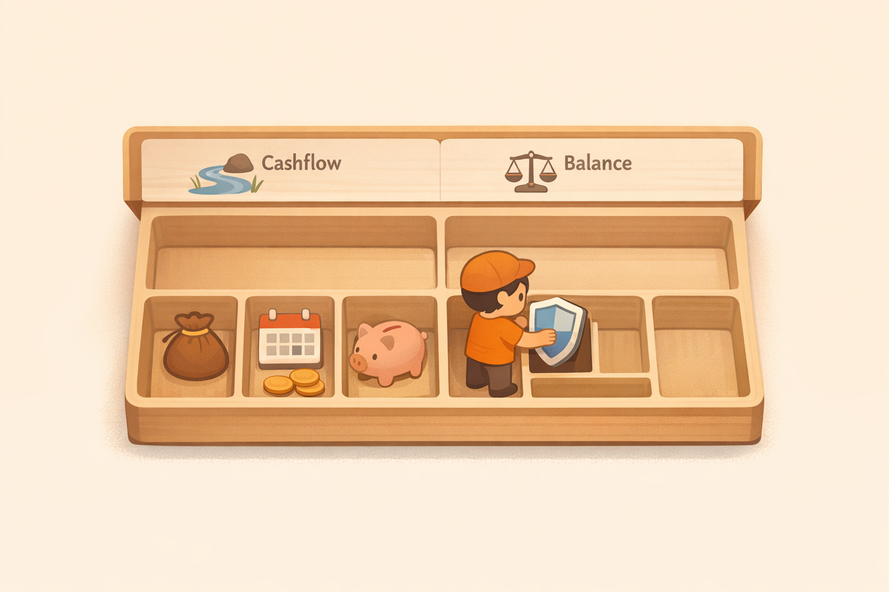

# 6. 당신의 재무 상태를 열어보세요: '대충'이라도 적어보는 현재 좌표

진정한 투자는 현재 내가 어디에 서 있는지 정확히 아는 것에서 시작된다. 이 챕터에서는 어렵고 복잡한 회계 지식 대신, 완벽하지 않아도 내 재무 상태와 현금흐름의 윤곽을 분명히 잡는 법을 익힌다. 게임으로 비유하면 인벤토리, 즉 내가 가진 것과 갚아야 할 것을 한 번 열어보는 과정이다. 내 주머니에서 새어나가는 돈을 찾아내고, 잠자고 있는 자산을 깨워 시스템의 엔진으로 활용하는 실전 기술을 다룬다.

<em>현재 좌표를 알아야 다음 행동을 정할 수 있다. 재무 상태표는 비난이 아니라 길찾기 도구다.</em>

---

[체크인 질문]

> • 당신의 재무 상태를 냉정하게 열어보는 것이 왜 두렵거나 막연하게 느껴지는가?
> 
> • 가장 최근에 당신의 지출 내역을 훑어보았을 때, 스스로도 이해하기 어려운 비합리적 지출은 무엇이었는가?
> 
> • 오늘 당신의 현재 좌표를 솔직하게 확인하는 것이, 미래의 경제적 자유에 어떤 단단한 기초 공사가 될 것이라고 기대하는가?

---

## 출발하기 전, 현재 상태부터 열어보자
앞 장에서 우리는 나만의 '북극성(목표)'을 찾았다. 목적지를 정했으니 이제 출발할 차례다. 그런데 잠깐, 출발하기 전에 꼭 해야 할 일이 하나 더 있다. 바로 지금 내가 가진 자산이 무엇인지, 갚아야 할 돈은 얼마인지, 매달 남는 돈은 어느 정도인지 확인하는 일이다.

현대 사회에서 이것을 재무상태표(Balance Sheet)와 현금흐름표(Cash Flow Statement)라고 부른다. 이름만 들어도 머리가 아프고 포기하고 싶어지는가? 걱정 마라. 우리는 회계사가 되려는 게 아니다. 그저 나의 현재 재무 상태와 돈의 흐름을 대충이라도 파악하려는 것뿐이다.

한 줄로 줄이면 이렇다. 재무상태표는 오늘 기준 내 자산과 빚을 보는 표이고, 현금흐름표는 한 달 동안 들어오고 나간 돈을 보는 표이다. 숫자가 정확히 기억나지 않으면 ‘모름’이나 ‘대략’으로 적어도 된다.

## 재무 상태 체크: "이게 다 내 돈이 아니었어?" (재무상태표)
재무상태표는 어느 한 시점(예: 오늘)의 내 자산과 빚을 정리한 표이다. 공식은 아주 간단하다.

> 자산(내가 가진 것) - 부채(갚아야 할 것) = 순자산(진짜 내 돈)

<em>자산, 부채, 수입, 지출을 한 화면에 꺼내면 막연한 불안은 점검 가능한 항목이 된다.</em>

많은 사람이 자산을 볼 때 흔히 범하는 실수가 있다. 비싼 자동차나 아파트를 갖고 있다고 해서 그게 모두 자신의 돈이라고 착각하는 것이다. 하지만 그중 상당 부분이 '대출'이라는 이름의 빌린 돈이라면, 당신의 진짜 순자산은 생각보다 낮을 수 있다.

- 자산: 현금, 예금, 주식, 부동산, 보험 해약환급금 등 '돈이 되는 모든 것'.
- 부채: 주택담보대출, 마이너스 통장, 카드 할부, 빌린 돈 등 '언젠가 갚아야 할 모든 것'.
- 순자산: 자산에서 부채를 빼고 남은 '진짜 내 돈'. 이 숫자가 바로 당신의 현재 재무 체력이다.

### [재무 상태 체크리스트 (재무상태표)]

처음 작성할 때는 빈칸이 있어도 괜찮다. 정확한 원 단위보다 “내가 무엇을 갖고 있고 무엇을 갚아야 하는지”를 화면에 꺼내는 것이 먼저다.

| 구분 | 내 재무 항목 (예시) | 금액 |
| :--- | :--- | :--- |
| 현금성 자산 | 입출금 통장, 비상금, CMA, 파킹통장 | |
| 투자 자산 | 주식, 코인, 펀드, ETF, ISA | |
| 연금/저축 | 퇴직연금(DC/IRP), 개인연금, 청약 | |
| 실물 자산 | 거주용 집(전세금), 자동차, 기타 부동산 | |
| (A) 자산 총계 | 모든 자산의 합 | 원 |
| 단기 부채 | 카드 할부금, 마이너스 통장, 신용대출 | |
| 장기 부채 | 주택담보대출, 전세자금대출 | |
| (B) 부채 합계 | 갚아야 할 총 금액 | 원 |
| 진짜 내 돈 | 순자산 (A - B) | 원 |

## 현금흐름 확인: "돈이 어디로 새고 있지?" (현금흐름표)
현금흐름표는 한 달 동안 내 주머니에 돈이 얼마나 들어오고, 어디로 얼마나 나갔는지 정리한 표이다.

> 수입(들어온 돈) - 지출(나간 돈) = 잉여 현금(저축과 투자의 재료)

아무리 소득이 높아도, 매달 버는 만큼 거의 다 써버린다면 통장은 언제나 0원에 가까워진다.

<strong>중요한 건 '얼마나 버느냐'보다 '내 손에 얼마가 남느냐'이다.</strong>

이 남은 돈이야말로 나중에 우리가 다룰 '복리의 눈덩이(7장)'를 만들 가장 소중한 재료가 된다.

### [현금흐름 로그 (현금흐름표)]

이번 달 금액이 헷갈리면 카드 앱이나 통장 내역을 보며 대략 적는다. 완벽한 장부보다 반복 가능한 기록이 더 중요하다.

| 구분 | 현금흐름 항목 (예시) | 금액 |
| :--- | :--- | :--- |
| 주수입 | 본인 급여, 사업 소득 | |
| 부수입 | 이자, 배당금, 부업, 당근 판매 수익 등 | |
| (A) 총 수입 | 입금된 모든 돈 | 원 |
| 고정 지출 | 월세/대출이자, 보험료, 통신비, 정기구독 | |
| 변동 지출 | 식비, 교통비, 취미/여가, 경조사 | |
| (B) 총 지출 | 소비된 모든 돈 | 원 |
| 잉여 현금 | 저축 및 투자 가능 금액 (A - B) | 원 |

## 🧐 왜 '대충'이라도 적어야 할까?
처음부터 소수점 단위까지 맞출 필요는 없다. 숫자를 마주하는 게 두려워 아예 눈을 감아버리는 것이 가장 위험하다.

1. 객관적 거리두기: 숫자로 내 상태를 보는 순간, 막연한 불안감은 '해결해야 할 문제'로 바뀐다.
2. 관점 바꾸기: "나는 왜 이렇게 돈이 없지?"라는 자책 대신, "아, 여기서 돈이 새고 있었구나. 여기만 막으면 다음 달엔 투자할 재료가 더 생기겠네"라는 전략적 사고를 하게 된다.
3. 기준점 기록: 현재 상태를 기록하는 것은 나중에 비교할 기준점을 남기는 일이다. 자산이 불어났을 때, 이때 적어둔 숫자를 보며 자신의 성장을 체감할 수 있는 소중한 데이터가 된다.

직접 적어볼 공간이 필요하다면 14장 부록의 `재무 상태 작성 워크시트`를 사용하면 된다. 이 장에서는 개념을 이해하고, 부록에서는 실제 숫자를 채워 넣는 방식으로 나누어도 충분하다.

> [!TIP]
> 완벽한 장부는 필요 없다.
> 가계부를 매일 쓸 자신이 없다면, 일주일에 한 번이라도 통장 잔고를 확인하고 큰 지출 항목만 적어보자. 복잡한 엑셀 대신 스마트폰 메모장이라도 좋다. '인식'하는 순간, 당신의 돈은 당신의 통제를 받기 시작한다.

## Sources

- Investor.gov, "Figure Out Your Finances": https://www.investor.gov/introduction-investing/investing-basics/save-and-invest/figure-out-your-finances
- FINRA, "Financial Foundations": https://www.finra.org/investors/insights/start-emergency-fund

---

[퀘스트 완료 레벨업 질문]

> • 이 챕터의 가이드에 따라 당신의 재무 상태를 정리했을 때 발견한, 뜻밖의 '잠자는 자산'이나 '새는 돈'은 무엇인가?
> 
> • 현재의 현금흐름을 북극성 방향으로 돌리기 위해, 당신이 당장 다음 장바구니에서 덜어내고 싶은 항목 하나는 무엇인가?
> 
> • 매달 한 번씩 재무 상태를 정기적으로 점검하기 위해, 당신의 달력에 어떤 이름으로 이 '셀프 재무 감사' 일정을 기록하고 싶은가?

---
