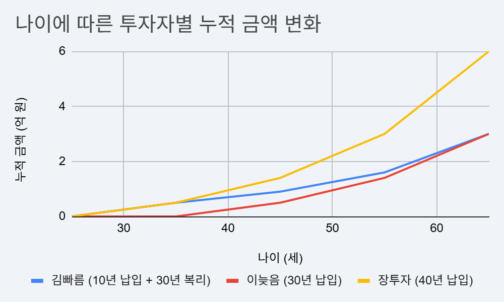

# 7. 지속 가능한 성장의 마법: 눈덩이를 굴리는 가장 쉬운 법 (복리와 시간)

투자의 가장 강력한 무기는 화려한 매매 기술이나 고급 정보가 아니라, 누구에게나 공평하게 주어진 '시간'이다. 이 챕터에서는 평범한 사람도 오래 살아남는 투자자로 만들어주는 복리의 마법과, 눈덩이를 굴리는 과정에서 우리가 반드시 지켜야 할 '기다림의 가치'를 다룬다. 조급함을 내려놓고 지속 가능한 성장의 시스템에 올라타는 법을 배운다.

<em>복리는 화려한 기술보다, 오래 굴러갈 수 있는 작은 반복에서 힘을 얻는다.</em>

---

[체크인 질문]

> • 당신이 투자 수익률이라는 숫자보다 '시간'의 힘을 더 믿지 못했던 이유는 무엇인가?
> 
> • 눈덩이를 굴리기 위해 가장 먼저 필요한 '작고 단단한 시드머니'를 모으는 과정에서 당신이 느끼는 가장 큰 현실적 장애물은 무엇인가?
> 
> • '지속 가능한 성장'이라는 단어가 주는 평온함이, 현재 당신의 조급한 마음을 어떻게 다독여주는가?

---

## 작은 눈덩이가 시간을 만나 커지는 방식
복리는 거대한 사건처럼 시작되지 않는다. 처음에는 너무 작아서 티가 나지 않는 돈 한 줌, 이번 달에 겨우 남긴 5만 원, 자동이체로 빠져나간 10만 원처럼 조용하게 시작한다.

눈덩이도 처음에는 손바닥 위에서 금방 녹을 것처럼 작다. 하지만 계속 굴리면 주변의 눈을 붙이며 조금씩 커진다. 처음에는 변화가 느리지만, 어느 순간부터는 눈덩이 자체의 무게가 다음 성장을 돕는다. 복리도 이와 같다. 중요한 것은 처음부터 큰 눈덩이를 만드는 것이 아니라, 녹지 않게 오래 굴리는 것이다.

## 당신의 통장에 작은 눈덩이를 남겨라
재테크도 정확히 똑같다.
통장을 웅장한 부의 요새로 만드는 건 로또 1등이나 하루아침에 10배 뛴 코인 같은 불꽃놀이가 아니다.
바로 이번 달에도 기어이 살아남은 아주 얄팍한 잔고 한 톨이 중단 없이 쌓이는 지루한 과정이다.

- **초반**: “이 푼돈 모아서 뭐해? 언제 집 사?”라는 생각이 드는 단계. 눈 한 톨이 햇볕에 금방 녹아버릴 것 같다.
- **중반**: 눈덩이가 조금 커졌지만, 여전히 한 번의 보상 심리(갑작스런 쇼핑, 여행, 맛집 투어)만으로 다 녹아 버릴까봐 위태로운 시기.
- **후반**: 복리가 본격적으로 힘을 드러내며, 내가 자는 동안에도 눈덩이가 스스로 굴러가는 단계. 이제는 녹는 것보다 커지는 힘이 더 강해진다.

복리는 초반에 너무 얌전해서 비웃음거리다.
그래서 대부분의 사람이 “에이, 이게 무슨 기적이야…” 하며 여름이 오기도 전에 제설 작업(소비 폭발)을 시작해버린다.
하지만 그 지루함을 견디고 작은 눈덩이를 끝까지 지켜낸 사람만이, 시간이 만든 성장의 차이를 경험한다.

<strong>장기적으로 선택지를 넓히는 힘은 ‘얼마나 뜨겁게 벌었느냐’보다 ‘얼마나 차갑게, 꾸준히 남겼느냐’에서 나온다.</strong>

오늘 당신이 참아낸 배달 음식값 1만 원, 커피 한 잔 값 5천 원, 충동구매 대신 남겨둔 옷 한 벌 값 3만 원, 이 작은 돈들이 모여 훗날 당신의 선택지를 지켜줄 눈덩이의 시작점이 될 수 있다.

## 워런 버핏의 진짜 무기는 '천재성'보다 긴 시간이다
사람들은 워런 버핏의 포트폴리오를 해부하고 그가 어떤 주식을 샀는지 분석한다. 하지만 그의 사례에서 가장 강력한 교훈은 '종목'보다 '시간'이다. 복리는 초반엔 조용하지만, 시간이 충분히 길어지면 뒤에서 큰 차이를 만든다.

우리가 흔히 말하는 뛰어난 투자자는 천재적인 두뇌로 단타를 쳐서 돈을 번 사람이 아니다. 그는 어린 시절부터 90대가 될 때까지, 긴 시간 시장 안에 남아 있었다. 그리고 그 긴 시간 위에서 복리가 일을 했다.

**만약 버핏의 투자 기간이 훨씬 짧았다면**
상상해 보자. 만약 버핏이 조금 '늦깎이'로 시작해서 보통 사람들처럼 30대에 투자를 시작하고, 60대에 "아이고, 이제 손주나 보며 쉬어야겠다"며 은퇴했다면 어떻게 됐을까?
아마 우리는 그의 이름을 지금처럼 기억하지 못했을지도 모른다. 그의 명성을 만든 자산의 상당 부분은 은퇴할 나이에 시장을 떠나지 않고, 복리가 크게 작동하는 후반부의 시간을 계속 통과했기 때문에 가능했다.

<strong>결국 부의 게임에서 최종 승자가 되는 비결은 꽤 괜찮은 수익률을 오래 유지하며 끝까지 살아남는 데 있다.</strong>

**자산을 키우는 열쇠는 기술보다 시간에 가깝다**
많은 이들이 차트 분석법이나 화려한 매매 기술을 배우려 한다. 하지만 평범한 투자자에게 더 중요한 것은 자주 사고파는 기술보다, 계획한 시스템을 오래 유지할 시간이다.
아무리 좋은 기술을 배워도 투자 기간이 짧으면 복리가 일할 여지가 작다. 반대로 수익률이 아주 화려하지 않아도, 수십 년 동안 중단 없이 유지하면 시간이 결과를 크게 바꿀 수 있다.

기억하자. 복리는 당신의 지능보다, 시장 안에 오래 남아 있었던 시간에 더 크게 반응한다.

## '72의 법칙': 내 돈이 두 배가 되는 시간을 가늠하는 법
복리의 마법이 추상적으로만 느껴진다면, `72`라는 숫자만 기억해도 된다. 이 숫자는 내 돈이 두 배가 되는 데 걸리는 시간을 대략 계산해 주는 도구다.
방법은 간단하다. 72를 연간 수익률로 나누기만 하면 된다. 예를 들어 연 6%의 수익률을 낸다면? 72 / 6 = 12, 즉 12년마다 당신의 자산이 두 배가 되는 속도에 가깝다는 뜻이다. 실제 수익률은 매년 흔들리므로, 이 공식은 정확한 예측표가 아니라 대략적인 감을 잡는 도구다.

다만 여기서 말하는 수익률은 통장에 찍히는 명목 수익률만으로 끝나지 않는다. 장기 목표에서는 세금과 수수료를 뺀 뒤, 물가 상승률까지 함께 봐야 한다. 예를 들어 예금 이자가 3%라도 물가가 3% 오르면 생활의 선택권은 거의 늘지 않는다. 복리가 진짜 힘을 내려면 "얼마가 찍혔는가"와 함께 "그 돈으로 살 수 있는 것이 실제로 늘었는가"를 같이 봐야 한다.

**세 사람의 시작 시점 비교**
세 사람이 같은 조건으로 돈을 모은다고 가정해 보자. 조건은 모두 연 수익률 6% 복리, 월 30만 원 납입, 세금·수수료·물가·중간 변동성은 제외한 단순 예시다. 실제 구매력은 물가에 따라 달라지므로, 아래 표는 원리를 이해하기 위한 참고 자료로 보면 된다.
1. **김빠름 (초반 스퍼트형)**: 25세에 시작해 딱 10년만 월 30만 원씩 붓고, 35세부터는 "난 할 만큼 했어"라며 추가 입금을 딱 끊었다.
2. **이늦음 (느릿느릿 거북이형)**: 25세엔 놀기 바빴다. 35세가 되어서야 정신을 차리고 65세 은퇴까지 30년 동안 한 달도 안 쉬고 월 30만 원을 부었다.
3. **장투자 (장기 지속형)**: 25세에 시작해 65세 은퇴까지 40년 동안 비가 오나 눈이 오나 월 30만 원씩 꾸준히 부었다.

| 나이 | 김빠름 (10년 납입 + 30년 복리) | 이늦음 (30년 납입) | 장투자 (40년 납입) |
|---|---|---|---|
| 25세 | 0억 | 0억 | 0억 |
| 35세 | 0.5억 | 0억 | 0.5억 |
| 45세 | 0.9억 | 0.5억 | 1.4억 |
| 55세 | 1.6억 | 1.4억 | 3.0억 |
| 65세 | 3.0억 | 3.0억 | 6.0억 |

그래프로 보면 변화는 더 명확하다.

<em>같은 돈도 언제 시작하고 얼마나 오래 유지하느냐에 따라 전혀 다른 곡선을 만든다.</em>

**여기서 확인할 수 있는 점**
- **'이늦음' 씨의 아쉬움**: 원금을 '김빠름'보다 3배나 더 많이 넣고도, 65세 시점 총자산은 비슷한 수준이다. '시작점'이 얼마나 중요한지 보여준다.
- **'김빠름' 씨의 시간 효과**: 딱 10년만 납입했는데도, 65세 시점에는 30년 동안 꾸준히 납입한 사람과 비슷한 규모까지 굴러간다. 복리가 일할 시간을 먼저 확보한 결과다.
- **'장투자' 씨의 지속 효과**: 일찍 시작한 '시간'과 오래 이어간 '성실함'이 만나면 자산은 훨씬 커진다. 표에서는 약 6억 수준까지 간다. 월 30만 원을 40년 넣은 원금은 약 1.44억인데, 나머지는 복리가 만든 결과다.

## 여유로운 투자자의 전략: 기다림의 가치를 아는 태도
역설적이게도 투자는 손가락이 부지런할수록 계좌가 야위기 쉽다. 매일 아침 차트를 확인하며 일희일비하고, '지금이 고점인가?' 싶어 샀다 팔았다를 반복하면 복리의 흐름이 자주 끊긴다.
오래 살아남은 투자자들은 재무 자동화 시스템을 켜둔 사람들과 같다. 이들은 좋은 시스템에 올라탄 뒤, 계좌 화면을 뚫어지게 쳐다보는 대신 현실의 일상과 본업을 챙긴다. 기다림도 투자 과정의 일부라는 사실을 받아들이는 사람들이다.

**복리의 중요한 원칙: 흐름을 불필요하게 끊지 않기**
찰리 멍거가 반복해서 강조한 메시지를 요지로 옮기면, 복리는 불필요하게 끊지 않는 것이 중요하다는 말에 가깝다. 우리의 뇌는 계좌에 파란불이 들어오면 "큰일 났다. 당장 뭐라도 해야 하나?"라고 반응하지만, 이때 필요한 건 화려한 매매 기술이 아니라 계획을 다시 확인하는 차분함이다. 하락장의 변동성을 내 인생을 망치러 온 벌금이 아니라, 장기투자를 이어가는 과정에서 감당해야 할 수수료로 이해하는 태도가 필요하다.

- **성급한 부지런이**: "오른다! 팔자! 떨어진다! 사자! 어? 수수료랑 세금 내니 남는 게 없네?" (결과: 복리 엔진 과열)
- **현명한 게으름이**: "내 북극성은 정해져 있고, 자동이체도 돌아가고 있다. 오늘은 내 일상에 집중하자." (결과: 복리 눈덩이가 끊기지 않음)

**좋은 시스템을 켜두고 기다리는 힘**
결국 당신을 경제적 자유에 더 가까이 데려가는 도구는 슈퍼컴퓨터급 분석 능력보다, 계획한 시스템을 오래 유지하는 태도다. 복잡한 차트 분석과 매일 쏟아지는 뉴스에 삶의 에너지를 전부 쓰지 않아도 된다.
"나의 구체적인 계획이 진행 중이고, 내 돈이 복리로 일할 시간을 줬으니 나는 내 할 일을 하겠다"는 근거 있는 느긋함이야말로 오래 투자하는 사람에게 필요한 태도다.

## Sources

- Investor.gov, "What is compound interest?" (Rule of 72 설명 포함): https://www.investor.gov/additional-resources/information/youth/teachers-classroom-resources/what-compound-interest
- Investor.gov, "Compound Interest Calculator": https://www.investor.gov/financial-tools-calculators/calculators/compound-interest-calculator
- Berkshire Hathaway, "2013 Letter to Shareholders" (PDF): https://www.berkshirehathaway.com/letters/2013ltr.pdf
- Morgan Housel, *The Psychology of Money* (Book) — 버핏 사례와 시간/복리의 중요성에 대한 참고 관점
- Charlie Munger, *Poor Charlie's Almanack* (Book) — 복리와 불필요한 중단을 피하는 태도에 대한 참고 관점

---

[퀘스트 완료 레벨업 질문]

> • 이 챕터에서 확인한 복리의 힘을 믿고, 앞으로 10년 이상 건드리지 않을 장기 계좌나 자동이체는 무엇인가?
> 
> • 장기 투자 도중 하락장을 만나도 시스템을 끄지 않기 위해, 미리 적어둘 나만의 점검 기준은 무엇인가?
> 
> • 오늘부터 복리의 시간을 시작하기 위해, 추가하고 싶은 첫 자동이체 금액과 실행일은 언제인가?

---
