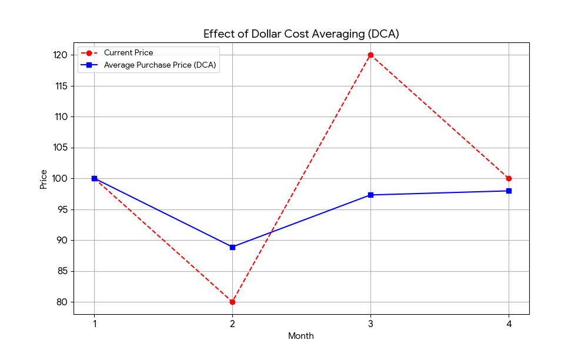
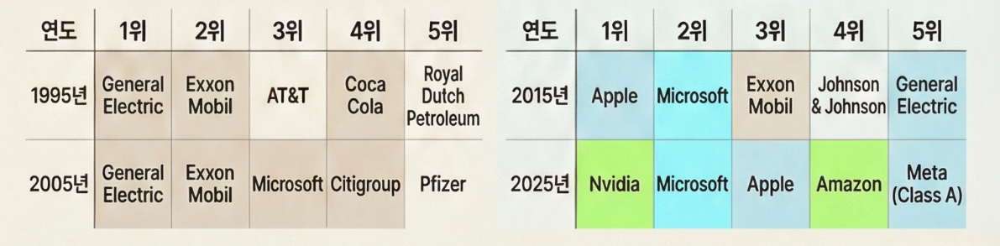

# 10. 거인들의 어깨 위에서 대충 날기 (시장 지수, 올웨더, 자산 배분)

성공적인 투자는 매번 정답을 맞히는 것이 아니라, 거인들이 이미 닦아놓은 길을 따라가는 것이다. 이 챕터에서는 시장 지수(Index)와 올웨더(All-Weather) 전략을 통해, 복잡한 예측보다 분산과 자산 배분으로 오래 버티는 방법을 배운다. 복잡한 분석 없이도 거인의 시야를 빌려 내 자산을 지키고 키우는 기본 포트폴리오 설계법을 소개한다.

여기서 소개하는 표와 자산 배분 예시는 특정 상품을 찍어주는 추천이 아니다. 독자가 시장 지수, 적립식 투자, 자산 배분이 어떤 구조로 작동하는지 눈으로 이해하기 위한 훈련용 지도다. 실제 선택은 소득, 부채, 비상금, 가족 상황, 투자 기간, 세금, 성향에 맞춰 조정되어야 한다.

---

[체크인 질문]

> • 위의 요약 내용을 읽었을 때, 당신이 직접 종목을 고르는 것보다 '거인의 어깨(시장 지수)'에 올라타는 것이 더 유리할 수밖에 없는 근본적인 이유는 무엇이라고 생각하는가?
> 
> • 여러 경제 환경을 견디도록 자산을 나누는 '올웨더(All-Weather)'라는 개념이, 당신의 고질적인 투자 불안을 어떻게 낮춰 주는가?
> 
> • 시장을 이기려는 소모적인 노력 대신 시장 그 자체가 되겠다는 발상의 전환이, 당신의 자산 관리 에너지 배분에 어떤 혁신적인 변화를 줄 것이라고 기대하는가?

---

투자의 세계에는 끝없이 험난한 지형을 맨몸으로 개척하려는 수많은 도전자들이 있다.
하지만 굳이 가시밭길을 맨발로 걸으며 피를 흘릴 필요가 있을까?
이미 그 길을 걸어 정상에 오른 거인들이 친절하게 남겨둔 '에스컬레이터'가 있는데도 말이다.
우리는 시간의 복리를 활용하면서 살아남기 위해 검증된 원칙을 빌리는 방법, 즉 거인들의 어깨 위에 올라타는 법을 배운다.

## 첫 번째 거인, 워런 버핏: "자본주의에 자본가(지분)로 로그인하라"
워런 버핏의 가장 핵심적인 조언은 "좋은 기업의 지분을 사서, 그 기업과 함께 성장하라"는 것이다.
이것이 주식 투자의 본질이다.
내가 회사에서 월급을 받으며 영혼을 갈아 넣는 동안, 내 자본도 '수익을 창출하는 또 다른 직장(우량 기업)'에 취직하여 일하게 만드는 것이다. 이것이 노동자에서 자본가로 마인드가 확장되는 첫걸음이다.

자본주의 사회에서는 돈이 시장의 흐름과 기업 성장에 맞춰 나 대신 일하도록 설계할 수 있다. 물가가 오르는 속도보다 빠르게 내 자산의 구매력을 방어하는 대표적인 방법 중 하나가 바로 이것이다.
하지만 좋은 기업을 '선별'하고, 언제 '사고팔지' 판단하는 기술은 초보자나 현실의 퀘스트(가족, 밥벌이)가 바쁜 사람들에겐 불가능에 가까운 영역이다.
그래서 버핏은 2013년 버크셔 해서웨이 주주서한에서, 배우자에게 남길 자산을 "S&P 500 인덱스 펀드 90% + 단기 국채 10%"로 두라는 원칙을 소개한 바 있다.
본인처럼 치밀하게 종목을 파고들 여력이 없다면, 시장 전체를 사는 것이 답이라는 뜻이다.

## 두 번째 거인, 존 보글: "모든 개별 기업의 흥망성쇠 대신, 시장 전체를 다 사버려라"

뱅가드 그룹의 창립자이자 인덱스 펀드(Index Fund)의 아버지인 존 보글(John Bogle)은 우리가 왜 개별 종목 대신 전체 시장을 추종(모방)해야 하는지 명쾌하게 답을 줬다.

**"건초더미에서 바늘을 찾으려고 애쓰지 마라. 그냥 건초더미 전체를 사라."**

여기서 바늘은 앞으로 크게 오를 '대박 주식'이고, 건초더미는 '주식 시장 전체(모든 기업의 모음)'다.

• **왜 바늘을 찾지 말라고 할까?**
개별 기업(아무리 훌륭해 보일지라도)은 CEO 스캔들, 경쟁사 등장, 트렌드 변화 등에 의해 하루아침에 반 토막 날 수 있다. 반면 시장 전체를 반영하는 지수(예: S&P 500, KOSPI)는 특정 기업이 망하면 퇴출당하고, 새롭게 떠오르는 기업이 그 자리를 채운다.
즉, 시장은 '우량한 상위권 클럽'의 멤버를 끊임없이 물갈이하며 '자동화된 생존 포트폴리오'를 제공하는 것이다.

미국 시장의 대표 기업만 봐도 이 변화는 분명하다. 한때 시장을 대표하던 제너럴 일렉트릭, 엑손 모빌, 코카콜라 같은 기업의 영향력은 줄어들었고, 2020년대에는 애플, 마이크로소프트, 엔비디아, 알파벳, 아마존 같은 기업이 지수의 큰 비중을 차지한다. 정확한 순위는 기준일과 지수 산정 방식에 따라 달라지지만, 핵심은 하나다. 시장의 주인공은 계속 바뀐다.

[도표] 시장 주도권 변화 예시
| 시기 | 두드러진 기업/업종 예시 | 투자자가 봐야 할 포인트 |
|---|---|---|
| 1990년대 | 제조, 에너지, 소비재 대기업 | 당대의 강자도 영원한 1등은 아니다. |
| 2000년대 | 에너지, 금융, 전통 IT | 경기와 금리, 산업 사이클에 따라 주도 업종이 바뀐다. |
| 2010년대 | 스마트폰, 플랫폼, 클라우드 | 새 산업이 커지면 지수 안의 무게중심도 이동한다. |
| 2020년대 | AI, 반도체, 빅테크 플랫폼 | 다음 주도 기업을 맞히기보다 변화 전체를 담는 편이 쉽다. |

이 표는 특정 연도의 정확한 시가총액 순위표가 아니라, 시장의 주도권이 시간이 지나며 바뀐다는 점을 보여주는 이해용 지도다.
하지만 '건초더미 전체를 산' S&P 500 같은 시장 지수 투자자는 기업의 흥망성쇠를 모두 직접 맞힐 필요가 없다. 지수는 정해진 방법론과 위원회 판단에 따라 구성 종목을 조정하고, 새롭게 떠오르는 기업을 편입하며, 기준에 맞지 않는 기업을 제외한다. 나는 그저 편안히 '시장 전체의 우상향' 파도(복리)에 몸을 맡기고 침대에 누워 자면 된다.

이것이 바로  'ETF(상장지수펀드)' 라는 마법의 아이템이다.
ETF를 통해 커피 몇 잔 값만으로도 세계 최고의 두뇌들이 일하는 기업들 수십, 수백 개를 하나의 바구니에 담아(분산 보유) 그들의 성과를 골고루 나눠 가질 수 있다. 자산 배분의 기본이자 '수비와 공격'을 동시에 해내는 가장 저렴하고 훌륭한 시스템이다.

이 다음 표들은 상품명을 고르기보다, 시장 전체와 시간에 올라타는 방식이 왜 초보자에게 이해하기 쉬운 출발점인지 보여주기 위한 장치다.

[표] 연간 총수익률 현황 예시 (S&P 500 Total Return, 배당 포함)
| 연도 | 수익률(%) | 연도 | 수익률(%) | 연도 | 수익률(%) |
|---|---|---|---|---|---|
| 1995 | 37.58 | 2005 | 4.91 | 2015 | 1.38 |
| 1996 | 22.96 | 2006 | 15.79 | 2016 | 11.96 |
| 1997 | 33.36 | 2007 | 5.49 | 2017 | 21.83 |
| 1998 | 28.58 | 2008 | -37.00 | 2018 | -4.38 |
| 1999 | 21.04 | 2009 | 26.46 | 2019 | 31.49 |
| 2000 | -9.10 | 2010 | 15.06 | 2020 | 18.40 |
| 2001 | -11.89 | 2011 | 2.11 | 2021 | 28.71 |
| 2002 | -22.10 | 2012 | 16.00 | 2022 | -18.11 |
| 2003 | 28.68 | 2013 | 32.39 | 2023 | 26.29 |
| 2004 | 10.88 | 2014 | 13.69 | | |

이 표는 S&P 500의 장기 변동성을 보여주기 위한 참고 자료다. 특정 ETF의 실제 투자 성과와는 다를 수 있고, 세금, 수수료, 환율, 매수 시점은 반영하지 않는다.
핵심은 매년 일정하게 오르는 자산을 찾는 것이 아니다. 크게 떨어지는 해도 있고 강하게 회복하는 해도 있다는 사실을 알고, 그 변동성을 견딜 수 있는 시스템을 먼저 설계하는 것이다.

* 장기투자의 10년 단순 시뮬레이션:
장기 투자는 변동성의 파도를 넘어서 복리의 마법을 누리는 기술이다. 시장은 단기적으로 오르내림을 반복하지만, 긴 시계열로 보면 결국 경제 성장과 함께 위로 향한다.
우리가 S&P 500에 매월 30만 원씩 10년간 적립식 투자를 했다고 가정해 보자. 투자 기간은 최악의 폭락장이었던 2008년 글로벌 금융위기 직전인 2007년 1월부터, 시장이 회복된 이후인 2016년 12월까지로 설정한다. 계산의 편의를 위해 연간 수익률을 단순화했고, 실제 월별 가격, 배당 재투자 시점, 환율, 세금, 수수료는 반영하지 않은 교육용 예시다.

[표] 10년 투자 시뮬레이션 예시
| 연도 (납입 횟수 누적) | 원금 (원) | 평가 금액 (원) - 단순 예상치 | 시장 상황 요약 |
|---|---|---|---|
| 2007년 (12회) | 3,600,000 | 3,500,000 | 상승 직후 금융위기 시동 |
| 2008년 (24회) | 7,200,000 | 4,200,000 | 대폭락장 (-37%, 평가 금액 반토막) |
| 2009년 (36회) | 10,800,000 | 7,500,000 | 회복 시작, 저점 매수 효과 발동 |
| 2011년 (60회) | 18,000,000 | 18,500,000 | 박스권 (원금 회복 및 소폭 수익) |
| 2013년 (84회) | 25,200,000 | 33,000,000 | 강한 상승장 시작 (+32%) |
| 2015년 (108회) | 32,400,000 | 42,000,000 | 안정적 우상향 지속 |
| 2016년 (120회) | 36,000,000 | 50,000,000 | 복리 효과 극대화 (약 38% 수익률) |

이 표의 목적은 미래 수익률을 약속하는 것이 아니다. 폭락 직전에 시작해도, 자동이체와 분산투자 원칙을 유지하면 투자 경험이 완전히 다른 방향으로 흘러갈 수 있다는 감각을 보여주는 것이다.

만약 2008년 폭락장에 두려움에 떨며 돈을 다 빼고 로그아웃해 버렸다면, 원금의 거의 절반을 잃고 끝났을 것이다. 하지만 이 시기에도 자동이체를 멈추지 않고 꾸준히 30만 원씩 투입한 사람(장투자형)은, 바닥에서 주식을 훨씬 싼 가격에 잔뜩 사 모으는 이른바 '평단가 인하 효과(Dollar Cost Averaging)'를 톡톡히 누렸다.
폭락장이라도 멈추지 않고 대충 꾸준히 샀기 때문에, 시장이 2013년부터 치솟기 시작할 때 그의 자산은 미친 듯이 복리로 팽창한 것이다.

[표] 주가 변동에 따른 적립식 매수의 평단가 인하 효과 (Dollar Cost Averaging)
| 월 | 주식 가격 (임의 예시) | 매수 금액 ($) | 매수한 주식 수 |
|---|---|---|---|
| 1월 | $100 | $1000 | 10주 |
| 2월 (폭락장) | $50 | $1000 | 20주 |
| 3월 | $80 | $1000 | 12.5주 |
| 총계 | (평균가 약 $76) | $3000 | 42.5주 (총가치 $3400) |

주식이 100달러에서 출발해 50달러로 반토막 났다가 80달러로 찔끔 올랐는데도, 이 단순 예시에서는 매달 규칙적으로 산 사람이 오히려 원금 대비 수익(+$400)을 본다.
시장이 내려가는 것을 더 많은 주식을 싼 가격에 모으는 '할인 행사'로 받아들일 수 있다면, 장기 투자에서 버틸 확률은 높아진다. 다만 적립식 매수도 손실 가능성을 없애지는 않는다.

## 세 번째 거인, 레이 달리오: "사계절을 견디는 방패, 자산 배분(올웨더 포트폴리오)"
버핏과 보글의 '주식 지수 투자' 전략은 훌륭하다. 하지만 주식 시장 특유의 롤러코스터 같은 변동성(-30% 이상 폭락 장)은 개인이 겪을 때 심리가 무너지기 너무 쉽다.
여기서 브리지워터 수장인 전설적 매니저 레이 달리오(Ray Dalio)가 구원투수로 등판한다.

답은 간단하다. 수영복, 패딩, 우산, 반팔 티를 모두 골고루 갖추면 된다. 폭염이 오든 한파가 오든 어떤 계절에도 당황하지 않고 쾌적하게 밖으로 나갈 수 있기 때문이다.

**"우리가 일기예보를 100% 맞출 수 없다면, 어떻게 옷장을 준비해야 할까?"**

이것이 투자에서는  '자산 배분(Asset Allocation)' 전략, 유명한  'All Weather Portfolio(올웨더/사계절 포트폴리오)' 로 구현된다.
달리오는 경제의 사계절을 4가지로 나눴다: 성장하는 봄날, 인플레이션이 덮치는 끈적한 심해, 디플레이션이 오는 겨울 등.
그리고 각 계절에 승리하는 자산군 – 주식(호황기), 장기 국채(디플레이션), 금(인플레이션 등), 안전 현금/원자재 – 을 적절한 비율로 섞어 바구니를 구성했다.

* **예시적인 자산 배분 모델**: 주식 40%, 장기 국채 40%, 금/원자재 20%
(참고: 널리 알려진 올웨더식 자산 배분 예시는 주식, 중기/장기 국채, 금, 원자재를 함께 섞는 구조다. 여기서는 원리를 쉽게 이해하기 위해 4:4:2로 단순화했다. 이는 절대적인 정답이나 추천 비율이 아니라 위험을 나누는 방식을 설명하기 위한 사례다.)

한 자산이 폭락하면 다른 자산이 오르면서 전체 계좌의 충격을 상쇄해준다. 물론, 주식 100%에 몰빵했을 때 대세 상승장이 오면 올웨더의 수익률이 조금 낮아 보일 수 있다. 하지만 투자의 목적은 '고수익 자랑 대회'가 아니라, '밤에 편히 자면서 안전하게 목적지까지 도달하는 생존'이다.

## 우리는 이제 어떻게 담을 것인가? 세 거인의 지혜를 하나로 합치기

이 거인들의 철학을 실천하려면 복잡한 수식보다 기준이 먼저 필요하다. 특정 상품명을 따라 사기보다, 다음의 자산군을 어떤 비율로 담을지부터 정하면 된다.

1. **존 보글 & 버핏**의 지혜: 미국 전체 시장, 혹은 전 세계 주식 시장을 추종하는 낮은 비용의 인덱스 상품.
2. **레이 달리오**의 지혜: 폭락장 충격을 줄이는 데 쓰이는 채권, 현금성 자산, 금 같은 방어 자산.

매달 당신의 여력 안에서 과소비하지 않고 비상금을 빼놓은 상태로, 성장 자산과 방어 자산을 7:3 혹은 6:4처럼 자신이 견딜 수 있는 비율로 기계적으로 쌓아 가는 방식을 생각해 볼 수 있다. 주식형 자산은 당신의 성장을 견인할 무기이고, 채권/금/현금성 자산은 위기 때 멘탈과 통장을 지켜줄 방패다. 중요한 것은 이 비율을 정답처럼 외우는 것이 아니라, 내 삶이 견딜 수 있는 변동성의 크기를 이해하는 것이다.

이게 투자냐고? 너무 지루하고 아무것도 안 하는 것 같다고?
정확하다! 당신의 돈은 가장 훌륭한 시스템에 속하게 되었고, 이 지루함 속에서 '시간'과 결합해 마법의 복리 눈덩이로 굴러갈 테니까. 일희일비는 개미들에게 맡겨라. 당신은 이제 거인의 어깨 위에서 '대충' 안전하게 하늘을 나는 고인물이 되었다.

상세한 정보나 어려운 용어는 13장 부록을 참고하면 된다. 다만 핵심 원칙은 이 장 안에서 이미 충분하다. 시장 전체에 올라타고, 오래 버티며, 내 상황에 맞게 위험을 나누는 것이다.

## Sources

- Berkshire Hathaway, "2013 Letter to Shareholders" (PDF): https://www.berkshirehathaway.com/letters/2013ltr.pdf
- Berkshire Hathaway, 2013 Annual Report (PDF): https://www.berkshirehathaway.com/2013ar/2013ar.pdf
- John C. Bogle, *The Little Book of Common Sense Investing* (Book) — "buy the haystack" 인용 출처
- S&P Dow Jones Indices, "S&P U.S. Indices Methodology": https://www.spglobal.com/spdji/en/methodology/article/sp-us-indices-methodology/
- Slickcharts, "S&P 500 Total Returns by Year" (연간 총수익률 표 검산용 공개 데이터): https://www.slickcharts.com/sp500/returns
- Bridgewater, "The All Weather Story" (White Paper, 2012): https://www.bridgewater.com/research-and-insights/the-all-weather-story

---

[퀘스트 완료 레벨업 질문]

> • 이 챕터에서 소개한 자산 배분 전략 중 당신의 현재 상황에서 가장 '따뜻하고 합리적'이라고 느껴지는 자산 비중(주식/채권/금 등)은 구체적으로 어떻게 되는가?
> 
> • 거인들의 전략을 본인의 것으로 만들기 위해, 당신이 오늘 새롭게 발견한 '자산 간의 상관관계(하나가 떨어질 때 다른 하나가 오르는 원리)' 한 가지는 무엇인가?
> 
> • 시장 지수와 자동 자산 배분을 통해 투자의 복잡함을 덜어낸 당신이, 그 남는 에너지와 시간을 투입하고 싶은 당신 인생의 '진짜 소중한 영역'은 무엇인가?

---
