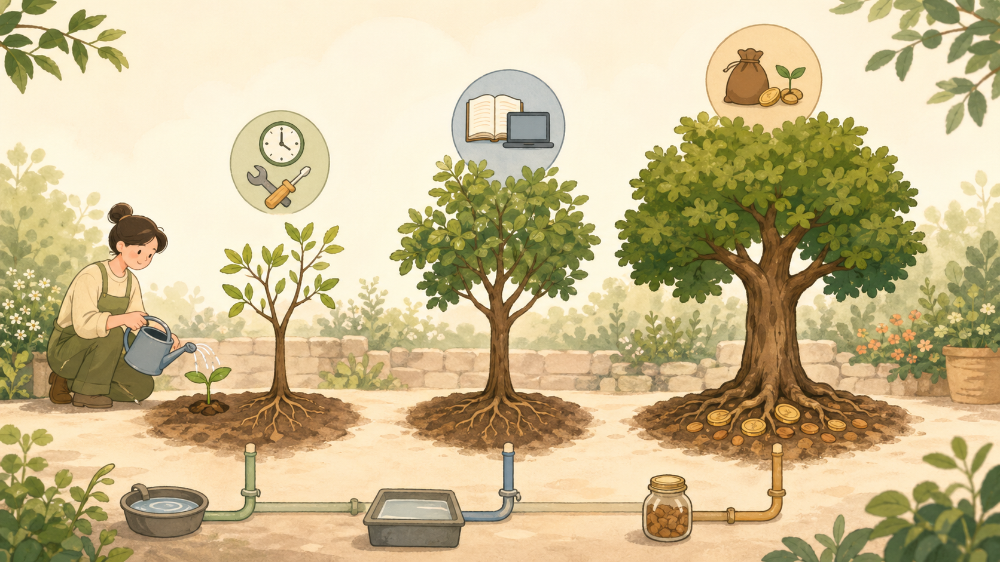

# 12. [히든 스테이지: 숨은 확장 단계] 내 장점으로 수익 장치 만들기: 돈의 파이프라인

마지막 히든 스테이지, 즉 숨은 확장 단계는 '성실함'의 프레임을 깨고 '시스템'의 판을 키우는 것이다. 이 챕터에서는 나 혼자의 노동력이 아닌, 자본과 도구가 스스로 일하게 만드는 레버리지의 진정한 의미를 짚는다. 성실한 저축을 넘어 부의 기하급수적 성장을 이끄는 최종 비법을 다루고, 내 삶의 주도권을 되찾으면서 수입 파이프라인(돈줄)을 여러 개로 늘리는 '돈 나무 심기' 전략을 완성한다.

---

[체크인 질문]

> • '성실하게' 투자 하면 성공할 수 있을까?
> 
> • 나의 노동력이 아닌 '자본과 시스템의 노동력'을 빌려 쓰는 것에 대해 어떤 생각을 가지고 있는가?
> 
> • '나는 여러가지 직업을 동시에 가질 수 있다'는 관점이 당신에게 어떤 새로운 가능성을 보여주는가?

---

지금까지 우리는 내면의 스크립트를 고치고(심리 방어), 지수 ETF와 올웨더 전략으로 자산을 안전하게 굴리며(투자), 인생의 계절에 맞춰 포트폴리오를 짜는 법(자산 배분)을 배웠다. 이른바 '새는 돈을 막고, 있는 돈을 묵묵히 굴리는' 수비수 훈련이었다.

하지만 아무리 훌륭한 수비수라도 골을 넣으려면 결국 '공격수'가 필요하다.
부의 무한 게임에서 투자가 '돈을 굴리는 엔진'이라면, 벌기(Earning)는 그 엔진을 돌리기 위해 끊임없이 부어줘야 하는 '최고급 연료'다.

연료통(수입원)이 직장 월급 하나뿐이라면, 그마저도 스트레스와 과로로 구멍이 나기 시작하면 엔진은 멈춰버린다.
장기 주식시장이 좋은 흐름을 보여도, 매달 넣을 원금이 없다면 복리의 마법은 그림의 떡이다.

그래서 이번 숨은 확장 단계에서는 불안감에 쫓기며 영혼을 갉아먹는 '벌기'가 아니라, 내 삶의 주도권을 되찾고 행복하게 수입 파이프라인(돈줄)을 여러 개 뚫는 '돈 나무 심기' 전략을 다룬다.

## 숨 막히는 압박에서 벗어나기: 단 하나의 파이프만 붙잡을 때 생기는 위험
가장 큰 불행과 스트레스는 '단 하나의 파이프라인(주 수입원, 대개 월급)'에 목숨을 걸 때 발생한다.
상사가 부당한 지시를 내려도, 야근으로 건강이 망가져도 우리가 쉽게 사표를 던지지 못하는 이유는 명확하다.
"이 수도꼭지가 잠기면 우리 가족은 굶어 죽는다."

하지만 투자의 세계에서 '분산 투자'로 리스크를 줄이듯, 벌기의 세계에서도 '분산 수입원(N잡, 파이프라인 다각화)'이라는 선택지가 있다. 이것은 당장 일을 더 벌이라는 압박이 아니라, 내 삶을 지키는 예비 통로를 하나씩 살펴보자는 제안에 가깝다.

<strong>여러 개의 파이프를 구축한다는 것은 당장 내일 페라리를 사기 위함이 아니라, "언제든 맘에 안 들면 이 수도꼭지 하나쯤은 잠가버려도 생존에 지장 없다"는 든든한 '심리적 방탄조끼'를 입는 일이다.</strong>

주 수입원(본업 월급) 외에 월 50만 원이 들어오는 파이프라인 2개만 더 있어도, 당신이 직장을 대하는 태도와 삶의 여유는 180도 달라진다. 이것이 진정한 의미의 경제적 자유, 즉 '선택의 자유'다.

## 돈 나무(파이프라인)의 3가지 품종: 나는 어떤 씨앗을 심을 것인가?
파이프라인 구축은 당장 내일 뚝딱 완성되는 요술 지팡이가 아니다.
과일나무를 심듯 씨앗을 고르고, 물을 주고, 열매가 맺힐 때까지 물고 늘어지는 시간이 필요하다. 다만 처음부터 세 품종을 모두 심을 필요는 없다. 당신의 성향과 현재 상황에 맞는 파이프라인 '품종'을 하나만 골라 작게 살펴보면 된다.

<em>파이프라인은 한 번에 완성하는 대박 장치가 아니라, 내 상황에 맞는 씨앗을 고르고 천천히 키우는 정원에 가깝다.</em>

🌱 **제1 품종: '시간을 돈으로 교환하는 나무' (노무 기반형 N잡)**
• 특징: 당장 오늘 저녁부터 할 수 있고, 한 만큼 즉각적인 현금(열매)이 꽂힌다.
• 예시: 대리운전, 배달 알바, 오프라인 파트타임, 단기 과외 등.
• 장점: 결과가 빠르고 확실하다. 초기 자본금이나 특별한 고급 기술이 없어도 몸과 시간만 있으면 된다.
• 단점/주의점: 내가 아프거나 쉬면 수입도 0이 된다. 철저히 '시간'을 갈아 넣는 방식이므로 장기적으로 지속하기 힘들고 번아웃이 오기 쉽다.
• 전략: 이 나무는 '단기 부스트용'이다. 빚을 빨리 갚아야 하거나, 다음 단계의 나무를 심기 위한 '초기 시드머니'를 모을 때 짧고 굵게 쓰는 전략적 파이프라인이다.
• 10분 첫걸음: 이번 주에 가능한 단기 일거리 3개를 적고, 몸과 일정에 가장 덜 무리가 가는 것 하나만 표시한다.

🌲 **제2 품종: '경험과 지식을 파는 나무' (가치 제공형 지식창업)**
• 특징: 내가 이미 본업에서 닦은 기술이나 취미, 경험을 '콘텐츠'나 '서비스'로 가공해 판매한다.
• 예시: 크몽/숨고 프리랜서(번역, 디자인, 영상 편집), 전자책(E-book) 출판, 원데이 클래스, 블로그/유튜브 수익 창출, 컨설팅.
• 장점: 육체노동보다 단가가 훨씬 높다. 한 번 만들어둔 콘텐츠(예: E-book, 온라인 강의)는 내가 자는 동안에도 팔릴 수 있는 '디지털 복제'의 마법을 지닌다.
• 단점/주의점: 열매가 맺히기까지(자리가 잡히기까지) 시간이 꽤 걸린다. 초반에는 "이거 해서 돈이 되나?" 싶은 '버티기의 계곡'을 지나야 한다.
• 전략: 내 본업의 가치를 높이거나 확장하는 쪽으로 연결하면 가장 좋다. 본업의 포트폴리오가 곧 부업의 상품이 되는 선순환 구조를 만들 수 있는 '가장 강력한 주력 나무'다.
• 10분 첫걸음: 내가 남보다 쉽게 설명할 수 있는 주제 하나를 고르고, 서비스 소개글 3줄만 써본다.

🌳 **제3 품종: '돈이 돈을 버는 나무' (자본 소득형 시스템)**
• 특징: 내 노동력이 거의 들어가지 않고, 묵직한 자본 자체가 파이프라인 역할을 한다.
• 예시: 든든한 배당주 포트폴리오, 월세가 나오는 부동산, 예적금 이자, 저작권료 등.
• 장점: 진정한 '패시브 인컴(Passive Income)'. 내가 여행을 가든 아파서 눕든 매달 통장에 돈이 꽂힌다.
• 단점/주의점: 나무를 심기 위해 강력한 '목돈(자본)' 혹은 '독보적 창작물'이 필요하다.
• 전략: 제1품종(노동 부스트)과 제2품종(가치 창출)을 통해 잉여 자금을 미친 듯이 모아, 최종적으로 이 제3품종의 밭을 넓혀가는 것이 부의 게임 생존 루트의 핵심이다.
• 10분 첫걸음: 다음 월급날에 자동으로 빠져나갈 투자 또는 저축 금액을 1만 원만 늘릴 수 있는지 확인한다.

## 행복하게 파이프라인을 뚫는 '대충' 실행법: 작고 가볍게 시작하기
N잡이나 파이프라인 구축을 포기하는 사람들의 공통점은 "완벽한 상품이나 아이디어를 찾아서 대박을 쳐야지"라는 압박감 때문이다.
거창한 기획안을 쓰다가 결국 유튜버 신사임당 같은 이들의 성공기에 짓눌려 시작도 전에 지쳐버린다.

행복한 벌기를 원한다면 초기엔 '비용 0원, 리스크 0원'에 가까운 방식으로 시작하는 편이 좋다.
잘 팔리면 좋은 거고, 망해도 '내 시간 조금 날린 셈' 치고 웃을 수 있어야 끝까지 간다.

1. **내 일상의 ‘불편함’과 ‘작은 재능’ 결합하기**
내가 평소에 무의식적으로 돈을 내고 해결했던 작은 문제들이 누군가에겐 돈을 주고 사고 싶은 재능일 수 있다.
"엑셀 피벗 테이블 돌리는 게 제일 쉬웠어요" ➔ 직장인 엑셀 꿀팁 PDF 전자책 1만 원에 팔기.
"나는 정리 정돈에 미친 사람이다" ➔ 주말 동네 당근마켓으로 '옷장 정리 컨설팅/대행' 5만 원에 올려보기.

2. **완벽주의 내려놓기: "대충 올려서 시장의 반응부터 보기"**
완벽한 로고나 거창한 웹사이트가 처음부터 필요하지는 않다.
블로그 글 한 편, 크몽 서비스 설명서 3줄, 당근마켓 게시글 하나면 충분하다. 1만 원이라도 결제가 일어나는지, 1명이라도 문의가 오는지(시장의 테스트)를 먼저 경험하는 것이 100배 중요하다.
결제가 일어나면 그때 가서 내용을 보완하고 퀄리티를 올리면 된다 (린 스타트업 방식).

3. **월 5만 원의 '첫 수익'에 소리 질러라**
파이프라인의 핵심은 액수가 아니다. "내 월급 외에, 오롯이 내 힘으로 독립적인 수입을 창출했다"는 강렬한 도파민이다.
이 첫 5만 원은 월급 500만 원과는 비교도 할 수 없는 자존감과 생존력을 뇌에 새겨준다. "어? 나 회사 잘려도 당장 굶어 죽진 않겠네?" 이 감각이 바로 당신을 옥죄던 불안의 목줄을 푸는 순간이다.

## 마무리: 파이프라인은 '생산자'로 태어나는 스위치다
돈을 번다는 것은 누군가에게 '가치(Value)'를 제공했다는 가장 정직한 피드백이다.
지금까지 우리는 남이 만든 물건을 '소비하는 사람(소비자)'으로 주로 살아왔다.
하지만 작은 파이프라인 하나를 뚫는 순간, 당신은 세상에 가치를 내놓는 '생산자'로 신분이 바뀐다.

생산자의 삶은 피곤해 보이지만, 사실 주도권이 나에게 있기에 짜릿하다.
'돈나무'가 한 그루, 두 그루 늘어날 때마다 당신의 계좌뿐만 아니라 세상을 바라보는 시선 자체가 풍성해질 것이다.

수비(투자)로 자산을 지키고, 공격(생산/벌기)으로 자본이 커질 통로를 조금씩 넓혀보면 된다.
불안이 줄어들면, 게임은 훨씬 재밌어진다. 당신의 첫 번째 파이프라인은 어디서 시작될까?

## Sources

- Eric Ries, *The Lean Startup* (Book) — 작은 실험, 시장 반응 확인, 빠른 학습에 대한 참고 관점
- Naval Ravikant, *The Almanack of Naval Ravikant* (Book) — 레버리지, 코드/미디어/자본의 확장성에 대한 참고 관점
- Morgan Housel, *The Psychology of Money* (Book) — 저축률, 선택권, 독립성에 대한 참고 관점

---

[퀘스트 완료 레벨업 질문]

> • 이 챕터에서 강조한 '판을 키우는 전략' 중 당신이 당장 다음 장바구니에서 덜어내고 실전으로 옮기고 싶은 소소하지만 강력한 변화는 무엇인가?
> 
> • 성실한 저축을 넘어 자본의 레버리지를 합리적으로 활용하기 위해, 당신의 현재 투자 비중(포트폴리오)에서 조금 더 적극적으로 확장하고 싶은 영역은 어디인가?
> 
> • 당신만의 수입 파이프라인 시스템이 완성되어 부의 판이 스스로 커지기 시작할 때, 당신이 이 책의 마지막 장을 덮으며 스스로에게 해주고 싶은 가장 당당한 약속은 무엇인가?

---
